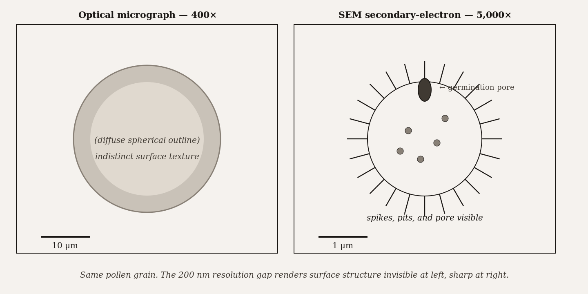
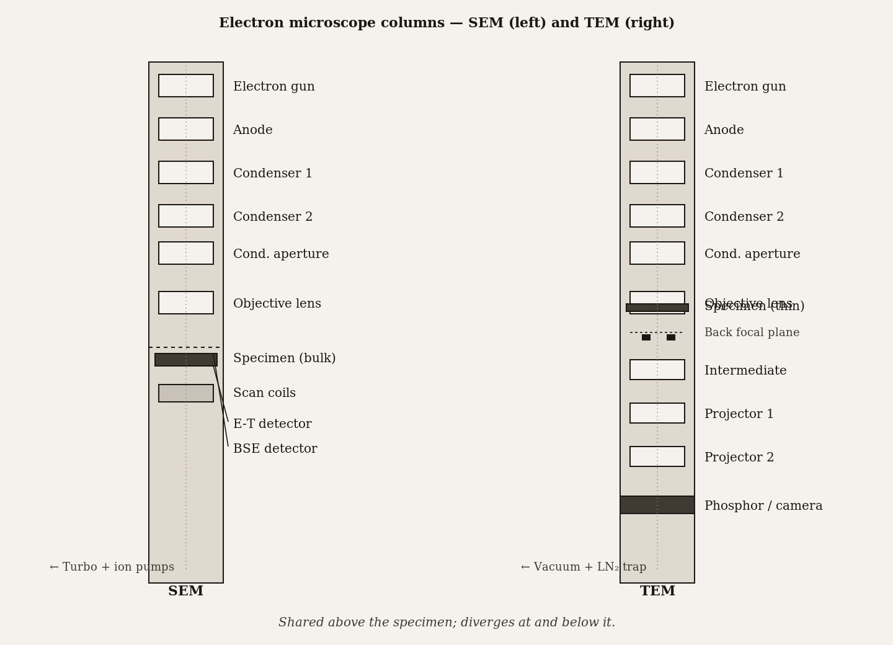

# Chapter 1 — Introduction to Electron Microscopy

*The ruler that measures a thing must be smaller than the thing being measured — and for a century, light was the wrong size.*

---

There is a pollen grain sitting on a stub of aluminum. It is roughly spherical, a few tens of micrometers across, and if you photograph it under a good optical microscope at 400× magnification, you can tell it is roughly spherical and has surface texture. That is about all. The spikes, the pits, the fine patterned ridges that distinguish one species from another — none of that resolves. It is not a question of having a better lens or a sharper eye. The features are there, sitting on the grain, physically real. The problem is something more interesting than imperfect engineering. The problem is that you are trying to measure things that are smaller than your ruler.

Green light has a wavelength of about 500 nanometers. The features on that pollen grain sit at 100 nanometers and below. When you try to form an image of a feature smaller than the wavelength of your imaging radiation, the waves do not cooperate — they diffract around the feature and the information smears. This is not a flaw you fix by grinding the glass more carefully. It is geometry.

Now slide the same pollen grain into a scanning electron microscope and image it at 5,000×. The image that comes back looks like a photograph from another world: ridges like mountain ranges, a germination pore like a crater. You have not changed the sample. You have changed the ruler.

That is the whole subject. Everything else in this book — the columns, the vacuum, the lenses, the preparation rituals, the different modes and detectors and techniques — is the consequence of that one substitution. We traded photons for electrons, and everything else followed.

*Figure 1.* Same pollen grain — optical (left) vs. SEM (right). The 200 nm resolution gap renders surface structure invisible at left, sharp at right.

---

The reason electrons work comes from a 1924 idea by Louis de Broglie. He proposed that particles have wavelengths, and the wavelength of a particle is

$$
\lambda = \frac{h}{p}
$$

where $h$ is Planck's constant and $p$ is the particle's momentum. That formula is the key to everything. Give an electron more energy and it moves faster, its momentum increases, and its wavelength shrinks. The way you give electrons a controlled, predictable energy in a microscope is to accelerate them through a voltage. An electron falling through 100,000 volts — 100 kilovolts — acquires kinetic energy $eV$ and ends up with a wavelength near 0.004 nanometers. That is roughly fifty thousand times shorter than green light.

Let that settle. If Abbe's resolution limit scales with wavelength — and it does, directly — then switching from photons to electrons does not improve your resolution by ten percent or by a factor of two. It improves it by fifty thousand. In principle.

The "in principle" carries a lot of weight, and we will spend several chapters unpacking it. For now, take the scaling: shorter wavelength, smaller resolvable features. The electron's wavelength at typical microscope voltages sits in the range of 0.002 to 0.04 nanometers, which is comfortably below the spacing between atoms in a crystal. An electron microscope can, under the right conditions, resolve individual atomic columns. Light microscopy cannot. This is not a quantitative gap; it is a qualitative one.

The classical statement of the limit for light microscopy is Abbe's equation:

$$
d = \frac{0.61 \lambda}{n \sin \alpha}
$$

where $d$ is the smallest separation between two points that still shows up as two points rather than one blur, $\lambda$ is the wavelength, and the denominator $n \sin \alpha$ is the numerical aperture — a measure of how wide an angle of diffracted light the lens can collect. For visible light with oil immersion and a generous numerical aperture of 1.4, the best you can do is around 200 nanometers. You cannot engineer past that with optics alone. The floor is the wavelength.

Plug 100 kilovolts into the de Broglie relation and you get $\lambda \approx 0.004$ nm. Apply Abbe's formula with even modest apertures and the theoretical resolution is well below one nanometer. In practice, aberrations in the electron lenses claw back much of that advantage, and modern instruments operate at resolutions of 0.1 to 0.2 nanometers for transmission work and 1 to 5 nanometers for scanning. Both are still far beyond anything light can achieve.

| Accelerating voltage | Electron wavelength | Theoretical resolution at α = 0.6° | Practical SEM/TEM resolution |
|---|---|---|---|
| **1 kV** | 38.8 pm (0.0388 nm) | 1.85 Å | ~5 nm (SEM, low-kV imaging) |
| **10 kV** | 12.2 pm | 0.58 Å | ~2 nm (SEM standard) |
| **100 kV** | 3.70 pm | 0.18 Å | ~2 Å (TEM, conventional) |
| **300 kV** | 1.97 pm (relativistic) | 0.094 Å | <1 Å (aberration-corrected TEM) |

*Wavelength shrinks non-linearly with voltage. Practical resolution is far worse than theoretical because spherical and chromatic aberration, not the wavelength, are the binding constraints.*

Why do the aberrations eat so much of the theoretical gain? Because electromagnetic lenses — the magnets that focus electrons, filling the role that glass plays for light — are fundamentally imperfect in ways that glass lenses can be ground past. The dominant pathology is spherical aberration: electrons traveling off the axis get focused too strongly, so the focal "point" is actually a disk. Controlling spherical aberration is the central engineering challenge of electron-microscope design. Modern instruments use software-corrected multipole aberration correctors; early ones simply used very small apertures to block the worst off-axis rays, which worked but discarded most of the beam. Chapter 2 goes into this in detail. For now: wavelength sets the ceiling for resolution; aberrations set the floor where you actually live.

---

Before we go further, there is a distinction between resolution and magnification that trips up nearly every newcomer and, embarrassingly, some experienced users as well.

Magnification is just enlargement. If you take a photograph and blow it up twice, you have doubled the magnification. You have not added any detail. The features in the image are exactly as sharp as they were before; each pixel just covers more physical space on your screen. At some point, increasing magnification stops revealing new detail and just makes the blur bigger. That point is called empty magnification, and every electron microscope has one. If you crank the magnification past the instrument's actual resolution, you get larger images with no additional information — and the temptation to think you are seeing something meaningful when you are not.

This matters in practice. An SEM image at 100,000× that looks soft probably means you are past the instrument's resolution limit for the conditions you have chosen: your voltage, your working distance, your aperture size. The fix is not to lower the magnification to 50,000× as if that reveals more. The fix is to ask what is limiting the resolution — is it focus? astigmatism? charging? beam damage? — and address that. Magnification is the display dial. Resolution is what the instrument can actually see. Keep the two separate.

---

The electron microscope family divides into two major architectures, and they are different enough that the same sample question — *what do I want to know?* — reliably routes you to one or the other.

In a **scanning electron microscope**, you focus the electron beam into a very fine probe — a spot — and park it on the surface of a bulk specimen. The electrons hit the surface, interact with the top few nanometers and the slightly deeper material below, and various signals come back: low-energy secondary electrons, which mostly report topography; higher-energy backscattered electrons, which report composition; characteristic X-rays, which report elemental identity. Detectors collect one or more of these signals and record an intensity for that point. Then electromagnetic scan coils tilt the beam to the next point, and the next, and so on, raster fashion, until the detector has collected intensities for every point in a grid — typically 1024 × 1024 or larger — and a computer assembles those intensities into an image.

The key fact about SEM is that the image is *built*, point by point. It is not projected. The specimen does not need to be thin. You can image a fractured turbine blade, a mouse cochlea, an integrated circuit, a corroded bolt, a single cell dried and coated in gold. SEM is remarkably tolerant of sample geometry. What it cannot do is tell you what is inside. The beam interacts with the surface and the near-surface; it does not pass through.

In a **transmission electron microscope**, you run the beam differently. Instead of focusing it to a fine probe, you spread it to illuminate a wide area of the specimen uniformly. The electrons that pass *through* the specimen — those that are not absorbed or scattered off to the side — hit a detector or camera and form an image directly. The image is a projection: a shadow of the internal structure.

That immediately tells you the constraint. For electrons to pass through, the specimen must be thin enough to be electron-transparent. For biological work this usually means below 100 nanometers; for atomic-resolution crystallography it means closer to 30 or 40 nanometers. Preparing specimens to that thickness — from a bulk piece of metal, or a biopsy, or a semiconductor device cross-section — is a substantial technical undertaking, and several chapters of this book are devoted to it. The payoff is that TEM can resolve atomic columns. A good TEM with an aberration corrector can achieve 0.1 nanometer resolution, which is sufficient to see where individual atoms sit in a crystal lattice and how that lattice is disturbed at a defect.

The table of trade-offs is worth seeing explicitly:

| | SEM | TEM |
|---|---|---|
| Image formation | Scanned probe, point by point | Wide beam, projected through specimen |
| Specimen | Bulk, surface | Thin (<100 nm), internal structure |
| Typical resolution | 1–5 nm | 0.1–0.2 nm |
| Best for | Surface morphology, topography, composition mapping | Internal ultrastructure, crystal structure, atomic imaging |

Neither is universally better. They answer different questions. The first discipline this book is teaching you is not how to operate the instrument — that comes later — but how to hear a research question and route it to the right machine.

<!-- → [INFOGRAPHIC: decision tree for SEM vs. TEM — root node: "What does your question ask about?"; branches: surface/topography/bulk specimen → SEM; internal structure/thin section/crystal lattice → TEM; mixed (e.g., surface morphology + elemental map) → SEM with EDS; atomic columns/diffraction → TEM with HRTEM or SAED; each terminal node names a technique and the chapter where it is covered] -->

A nanomedicine group asks: *what shape are our lipid nanoparticles, and how dispersed is the population?* That is a surface question on a large number of particles. SEM at moderate magnification gives you hundreds of particles per field of view, enough for statistics. A mineralogist asks: *is there a crystalline phase boundary inside this grain, and what is the orientation relationship between the two phases?* That question requires atomic-scale information about the interior. TEM — and probably selected-area electron diffraction, which Chapter 15 covers. A failure-analysis engineer asks: *what is the defect at the surface of this failed die?* SEM. The same engineer asks: *is there a void inside the metallization at a known depth?* TEM, after a focused-ion-beam cross-section to expose the buried feature.

The verb in the research question usually gives it away. *Describe the surface* routes to SEM. *Resolve the interior structure* routes to TEM. Write the question before you book instrument time.

---

Let me give you a picture of what the instrument actually is, because the vocabulary helps in every chapter that follows.

An electron microscope is a column. Read it top to bottom, in roughly the order electrons travel.

At the top is the **electron gun**, the source. There are three main families. *Thermionic guns* heat a wire or crystal — tungsten or lanthanum hexaboride — until electrons boil off. Cheap and tolerant, but the beam is relatively broad and the energy spread is wide. *Field-emission guns* apply an extreme electric field at a very sharp tip, drawing electrons out by quantum tunneling at room temperature. The virtual source is thousands of times smaller, the brightness is a hundred to a thousand times higher, and the energy spread is much smaller. The image quality from a field-emission SEM at low voltage is simply in a different league from a thermionic SEM. *Schottky guns* split the difference — thermal field emission — and are the dominant choice in modern analytical TEMs. The gun determines what the beam is capable of; everything downstream works with what the gun provides.

Below the gun is an **accelerating stage**: a potential difference between cathode and anode that gives the electrons their kinetic energy and therefore their wavelength. SEM typically runs 0.1 to 30 kilovolts; TEM runs 80 to 300 kilovolts for most commercial instruments, with specialized machines reaching 1 megavolt for very thick specimens.

Then come **condenser lenses** — electromagnetic solenoids whose magnetic field geometry focuses the beam, demagnifying the source image and controlling how much current reaches the specimen. The "spot size" or probe-current controls on the SEM console are mostly changing condenser-lens excitation.

**Apertures** are metal plates with small circular holes that intercept electrons traveling too far off-axis. Smaller apertures mean less aberration and a sharper probe, but they also discard more of the beam and reduce the signal. Every aperture choice is a trade between resolution and brightness.

The **objective lens** does the heavy lifting: in an SEM it focuses the beam to the smallest possible probe at the specimen surface; in a TEM it forms the primary image of the transmitted electrons. The objective lens is the precision component, mechanically and magnetically, and its aberration coefficients largely set the resolution ceiling.

**Scan coils** (SEM) or **projector lenses** (TEM) come after. In SEM, the scan coils are what rasters the probe — the magnification is set by how small an area the coils scan relative to the display size. In TEM, projector lenses magnify the objective-lens image and throw it onto a screen or camera.

The **specimen chamber** sits at the center. In an SEM this is a relatively large room — bulk specimens go in through a door, the stage translates x, y, z, and usually tilts. In a TEM the chamber is tighter and the specimen slides in on a thin rod through an airlock.

All of it lives inside a **vacuum system**. Electrons traveling through air scatter off gas molecules within centimeters at atmospheric pressure. The column operates at pressures of $10^{-4}$ pascal or better — roughly ten billion times lower than atmosphere. Maintaining that vacuum requires ion pumps, turbomolecular pumps, and gauges that you will become very familiar with once you are doing your own work on the instruments.

Finally, **detectors** and a **computer**. The diversity of detectors is worth a sentence: an SEM can have an Everhart-Thornley secondary-electron detector, a semiconductor backscatter detector, an energy-dispersive X-ray spectrometer, and more. A TEM has a fluorescent viewing screen for rough alignment, and CCD or direct-detection cameras for recording images and diffraction patterns. Chapter 7 goes into SEM detectors; Chapter 13 goes into TEM cameras.

The whole system is one long chain of trade-offs, each component with its own optimum that does not coincide with its neighbors' optima. A brighter gun lets the condenser lenses spread current more generously, but it costs more vacuum and more money. A smaller objective aperture cleans up aberrations, but it reduces signal and extends the exposure time needed. Higher accelerating voltage means a shorter wavelength and potentially better resolution, but it also means more beam damage to radiation-sensitive specimens. The operator's job is to navigate the few degrees of freedom left accessible at the console, with an understanding of what is being traded against what.

*Figure 2.* Generic electron microscope columns — SEM (left) and TEM (right). Components above the specimen are shared; below, the two diverge.

---

The history I want to give you is a short one, because the important point is not a list of names and dates — it is the gap between the idea and the instrument.

J.J. Thomson identified the electron at Cambridge in 1897. Louis de Broglie proposed the wave nature of matter in 1924, which immediately implied that electrons could be used for imaging with wavelengths far shorter than light. The first electron microscope — a primitive transmission instrument with no practical resolution advantage yet — was built by Max Knoll and Ernst Ruska in 1932. Eight years. That gap between *de Broglie predicts this is possible* and *Ruska builds one in Berlin* is the normal lag between insight and tool. It took another few years before the instrument exceeded the resolution of a good light microscope, which happened around 1933. The first commercial TEM appeared in 1939. The first commercial SEM appeared in 1965.

The wonder in that history is that the same physics — the de Broglie wavelength, the fact that electrons interact with matter in ways a photon does not — that made imaging possible also opened up diffraction (Chapter 15), spectroscopy (Chapters 9 and 18), and tomography (Chapter 19). One quantum, many modalities.

<!-- → [INFOGRAPHIC: horizontal timeline from 1897 to 1965 — milestones: 1897 Thomson identifies electron; 1924 de Broglie wave-particle duality; 1926 Busch demonstrates magnetic focusing; 1932 Knoll & Ruska first TEM; 1933 EM exceeds optical resolution; 1938 von Ardenne first SEM; 1939 first commercial TEM; 1965 first commercial SEM; gap between 1924 and 1932 visually emphasized to illustrate the idea-to-instrument lag] -->

---

Before the next chapter, here is the question this one raises but does not answer.

If the electron wavelength at 100 kV is around 0.004 nanometers, why does a TEM resolve 0.1 to 0.2 nanometers — fifty times worse than the wavelength would predict? The answer is spherical aberration, and the story of how the field has spent ninety years fighting it — apertures, computer correction, hardware correctors — is Chapter 2. What I want you to carry out of this chapter is the right picture of the problem: not that electron microscopes are limited, but that they are limited by something specific, and that specific thing can be named, quantified, and to a significant extent corrected. Resolution in electron microscopy is not a mystery. It is a set of known aberration coefficients with known engineering countermeasures.

That is the character of this whole field: the physics is rich but it is not arbitrary. Every limitation has a name. Every instrument choice has a reason. By the time you finish this book, you will not just know how to turn the knobs — you will know why each knob does what it does, which means you will know what to do when the image is wrong.

---

## Exercises

### Warm-up

**1.1** — State in one sentence, without using the words "magnification" or "resolution," why an electron microscope can image features that a light microscope cannot. *(Tests: wavelength → imaging limit.)*

**1.2** — A visible-light microscope uses green light at 530 nm with oil immersion (NA = 1.4). Using Abbe's equation, calculate the diffraction-limited resolution. An SEM operating at 15 kV has a practical resolution of 3 nm under typical conditions. By what factor does the SEM outresolve the optical microscope? *(Tests: Abbe calculation; order-of-magnitude sense for the wavelength gap. Difficulty: easy.)*

**1.3** — List three specimen properties that TEM requires but SEM does not. For each, state in one clause *why* TEM requires it. *(Tests: SEM vs. TEM specimen constraints. Difficulty: easy.)*

### Application

**1.4** — A materials scientist wants to study the grain-boundary microstructure of a stainless-steel weld: first to survey the macroscopic morphology of grains across the weld zone, then to identify whether dislocations are present inside individual grains at the atomic scale. Which technique addresses each sub-question? What specimen preparation step does each require that the other does not? *(Tests: technique routing by research question. Difficulty: medium.)*

**1.5** — An SEM image at 80,000× appears soft despite correct focus and stigmation correction. The same area imaged at 40,000× is crisp. Define empty magnification, identify which parameter you would check first to understand why this instrument's empty-magnification limit falls where it does, and name one instrument-side adjustment that might extend the useful magnification ceiling. *(Tests: resolution vs. magnification distinction; empty magnification in practice. Difficulty: medium.)*

**1.6** — An electron gun is upgraded from a tungsten thermionic source to a cold field-emission gun. The operator keeps all other column settings identical. Predict what happens to: (a) beam brightness, (b) probe size at the specimen, (c) image resolution at low kV, and (d) required vacuum level in the column. Justify each prediction in one sentence. *(Tests: gun type → downstream consequences. Difficulty: medium.)*

**1.7** — Using the non-relativistic de Broglie relation $\lambda \approx 1.226 / \sqrt{V}$ nm, calculate the electron wavelength at 1 kV, 10 kV, and 100 kV. Plot or sketch $\lambda$ vs. $V$ on log-log axes. What does the slope tell you about how quickly additional voltage buys resolution improvement? *(Tests: de Broglie calculation; diminishing returns of voltage scaling. Difficulty: medium.)*

### Synthesis

**1.8** — A research group has access to a thermionic-gun SEM (practical resolution ~10 nm at 25 kV) and a 200 kV TEM (practical resolution 0.2 nm). They are studying 5 nm gold nanoparticles on a carbon support film: they want (a) population-level size statistics across thousands of particles, and (b) confirmation that individual particles are single-crystal with a specific lattice orientation. Assign a technique to each goal, explain the trade-off accepted in each case, and name one artifact specific to each technique that could compromise the result. *(Tests: technique routing + artifact awareness across both instrument families. Difficulty: hard.)*

**1.9** — The column component walkthrough in this chapter describes every aperture as a trade between resolution and brightness. Trace that trade through the entire column: starting at the gun, explain how restricting beam angle at three separate points (condenser aperture, objective aperture, and detector acceptance angle) each independently costs something while buying something else. What does this chain of trade-offs imply about how the operator should think about optimizing the column for a beam-sensitive biological specimen versus a radiation-tolerant metal alloy? *(Tests: system-level thinking; trade-off chain from gun to detector. Difficulty: hard.)*

### Challenge

**1.10** — Find a published electron-microscopy figure in a paper from your own field. Determine whether it is SEM or TEM (state your evidence). Identify the accelerating voltage from the methods section and compute the theoretical electron wavelength. Then look up the stated resolution or pixel size of the image and compute how far the practical performance sits below the theoretical wavelength limit. Propose one specific reason, drawn from this chapter's discussion of aberrations and instrument constraints, for the gap. *(You will return to this exercise after Chapter 2 to see whether your proposed reason holds up. Difficulty: open-ended.)*

---

 an empirical demonstration that visible-light microscopy can routinely resolve below 100 nm without exotic super-resolution methods that effectively bypass the Abbe limit through fluorophore localization rather than direct imaging. (Localization techniques like STORM and PALM do achieve sub-100-nm resolution; they do not contradict Abbe for direct imaging.)

**Still puzzling:** why electron microscope manufacturers routinely list "resolution" specs in the single-angstrom range when most working laboratories operate well above that limit. The gap between specification and routine practice is a calibration question Chapter 23 will start to address.

