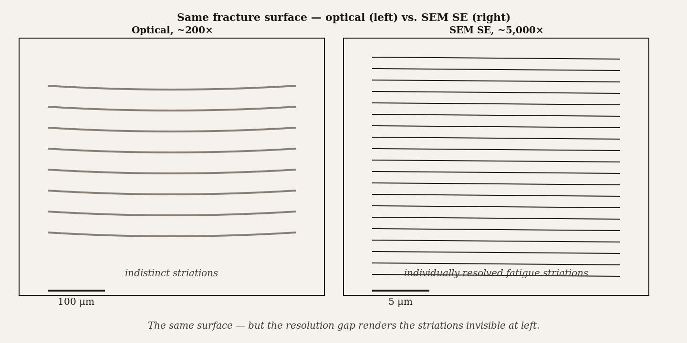
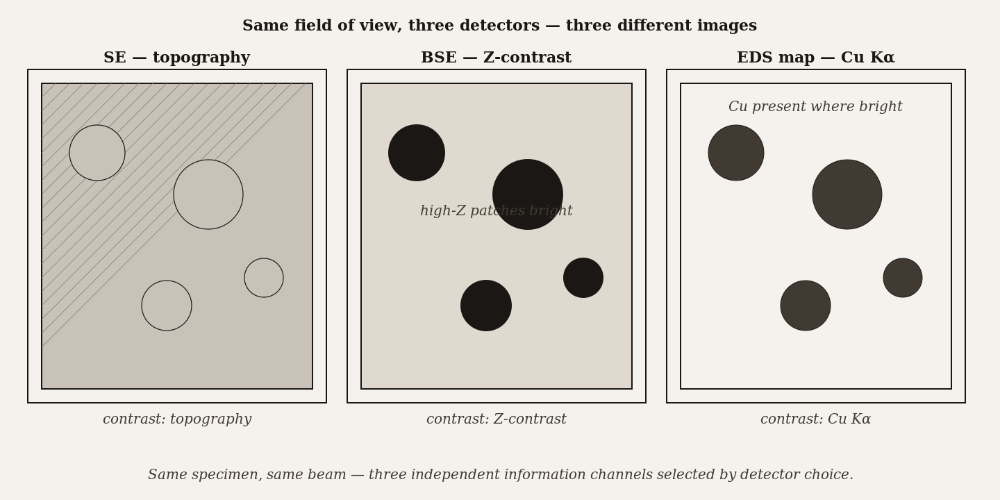
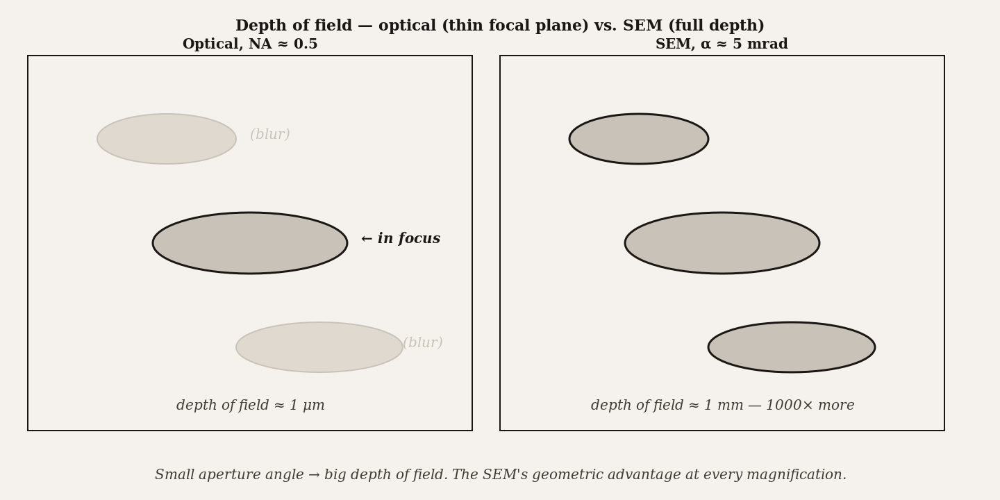

# Chapter 4 — Introduction to Scanning Electron Microscopy

*Every image the SEM makes is a lie — a constructed fiction of intensities — and understanding that lie is what makes you an operator.*

---

A fractured turbine blade arrives at the failure-analysis lab in a sealed evidence bag. The blade snapped at 40,000 RPM during a test run, and the engineering team needs to know why. An optical micrograph of the fracture surface shows striations — curved, closely spaced bands that record the history of fatigue crack growth — but at 200× the optical microscope cannot resolve the individual beach marks well enough to count them. The technician carries the fragment to the SEM, mounts a small chunk on an aluminum stub, sputter-coats it with a few nanometers of gold-palladium, and pumps the chamber. Twenty minutes later they are looking at a 5,000× image of the fracture surface with individual striations resolved a few hundred nanometers apart. Each striation is one fatigue cycle. The technician counts them, multiplies by the cycle frequency, and within an hour tells engineering: the blade survived 1,800 cycles before failure.

That is the SEM's core proposition. Not merely higher magnification — the optical microscope could have been zoomed in further, accomplishing nothing — but genuine resolution of surface detail, at nanometer scales, on a bulk fragment that no TEM in the world could accept into its specimen holder. The SEM and the TEM are not a faster and slower version of the same instrument. They are answers to different questions.

The question the SEM answers is: *what does the surface look like, and what is it made of?* Everything about the instrument's design follows from that.

*Figure 1.* Same fracture surface — optical (left) vs. SEM SE (right). The resolution gap renders the fatigue striations invisible at left.

---

An SEM builds its image one point at a time. This is the first and most important thing to understand about it, because it is so different from how every other imaging instrument you have used works. A camera, an optical microscope, a TEM — all of them project a whole-field image onto a detector simultaneously. The SEM does not. It parks a finely focused beam on a single point of the specimen, counts whatever signal comes back during a brief dwell, assigns that count to a pixel in a memory array, then moves the beam to the next point. Raster across the full field — line by line, pixel by pixel — and you have a frame. A typical publication-quality image contains $1024 \times 1024$ pixels, over a million of these individual measurements assembled into one picture.

The architecture that does this is not complicated, but each piece has a specific job that is worth keeping separate.

The **electron-optical column** — gun, condenser lenses, objective lens, apertures — forms a focused probe at the specimen surface. We covered this in detail in Chapters 2 and 3. The column's job is to deliver a spot of electrons as small and bright as the instrument can manage. For a tungsten thermionic gun at 20 kV, that spot is several nanometers in diameter; for a cold field-emission gun at 5 kV, it can be under a nanometer. Everything the SEM can resolve is limited at the top by the probe size the column produces. Nothing downstream compensates for a large, aberrated probe.

The **deflection system** is two pairs of electromagnetic coils mounted inside the column between the condenser and objective lenses. The coils deflect the beam in $x$ and $y$. Drive them with a sawtooth waveform in $x$ and a slower sawtooth in $y$, and the probe walks across the specimen surface line by line — the raster. Increasing the magnification means exciting the coils less strongly, so the beam deflects across a smaller area of the specimen. The display size is fixed; the scanned patch shrinks; the apparent magnification rises. This is worth stopping over, because it is unlike any previous microscopy. There is no optical element changing when you turn the magnification knob. The column is static. You are changing how far the coils tilt the beam, and therefore how large a patch of specimen gets mapped onto the fixed pixel array.

The formal statement is:

$$
M = \frac{L}{\ell}
$$

where $L$ is the edge length of the displayed image and $\ell$ is the edge length of the scanned area on the specimen. A 25 cm monitor displaying a scan of a 250 nm patch gives $M = 10^6$. A 250 μm patch gives $M = 10^3$. The knob is a current control for the coils; the magnification is the geometric ratio that results. Operators who understand this choose magnification by asking "how large is the area I need to see?" and computing $\ell$, then dialing $M$ accordingly. Operators who do not understand it turn the knob until the image looks big enough.

<!-- → [INFOGRAPHIC: diagram showing how SEM magnification works electronically — three panels side by side: (1) scan coils fully excited, beam sweeps large patch on specimen → low M; (2) coils partially excited, beam sweeps medium patch → medium M; (3) coils minimally excited, beam sweeps tiny patch → high M; all three map to the same fixed display size; arrows label L (display edge), ℓ (scanned patch edge), and M = L/ℓ for each panel; student should see that the column and probe are identical in all three — only the coil current changes] -->

The **detectors** — one or several — sit inside the specimen chamber and convert the signals emitted by the specimen into electrical currents. The computer samples each detector during the dwell time at each pixel, stores the intensity, and assembles the frame. Modern SEMs can record multiple detectors simultaneously, producing several images of the same field from a single scan.

The **computer** drives everything: the scan-coil waveforms, the detector sampling, the image storage, the contrast and brightness controls, the stage, the vacuum alarms, the gun saturation watchdog. The image that appears on the monitor is not an analog signal; it is a digital array. The SEM is a data-acquisition system that happens to produce images.

The **operator** is the remaining degree of freedom. Accelerating voltage, probe current, objective focus, aperture selection, magnification, scan rate, dwell time, working distance, detector choice — these are the parameters the operator sets, and they determine everything about image quality. Chapter 5 works through the discipline of choosing them. For now, notice that the operator is listed as a subsystem, not an appendage. The instrument and the operator are one integrated system. A skilled operator with a mediocre instrument routinely outperforms the reverse.

---

Now: what is the SEM image actually an image *of*?

This question has a subtler answer than it appears. An optical photograph is an image of light reflectance. A TEM bright-field image is an image of electron transmission. An SEM image is an image of *signal yield* — specifically, the yield of whatever the active detector is measuring, at each point of the raster. Change the detector, and the same specimen produces a completely different-looking image. They are not more or less correct versions of the same picture; they are measurements of different physical quantities.

The most common detector in routine SEM is the **Everhart-Thornley**, a combined secondary-electron and backscatter collector mounted to the side of the specimen chamber. It draws in low-energy secondary electrons with a small positive bias on a collector grid, accelerates them into a scintillator, and converts them to light for a photomultiplier. The image it produces looks, to the human eye, remarkably like a photograph taken with a light source positioned at the detector. The three-dimensional topography of the specimen reads naturally because the eye evolved to interpret light-and-shadow as relief. This is why SEM images look like photographs of tiny landscapes. It is not accidental — the detector was designed to exploit that perceptual interpretation — but it is not a photograph. The "illumination" is signal yield, not light.

**Secondary electrons** are the workhorse signal. They are low-energy electrons — mostly under 50 electron-volts — knocked out of the specimen by the primary beam. Because of their low energy, they can only escape from the top few nanometers of the surface. This makes secondary-electron images extremely surface-sensitive. A small bump, an edge, an overhanging feature — all of these present more surface area toward the detector and produce a locally higher SE yield, which reads on the image as brightness. This is topographic contrast.

**Backscattered electrons** are a different measurement entirely. These are primary-beam electrons that have elastically scattered off atomic nuclei and bounced back out of the specimen with much of their original energy. The probability of backscattering scales with atomic number: a high-Z element like gold backscatters efficiently; a low-Z element like carbon barely backscatters at all. In a backscattered-electron image, brightness encodes composition, not topography. A BSE image of an alloy with gold precipitates in an aluminum matrix shows the gold as bright patches on a dark background. If you read those bright patches as hills, you are misinterpreting the image. They are heavy, not tall.

**Characteristic X-rays** are the basis of energy-dispersive spectroscopy, covered in Chapter 9. When the primary beam ionizes a core electron, the atom relaxes by emitting an X-ray whose energy is a fingerprint of the element. An EDS detector collects these X-rays and builds a spectrum or a map. This is elemental analysis, not morphology, and it uses a third detector on the same specimen under the same beam.

The point is this: the SEM is not a camera. It is a scanning probe that triggers multiple physical processes simultaneously, and the image you see depends entirely on which physical process you chose to detect. An operator who does not know which detector is active — and what that detector measures — will misread the image. Beginners sometimes mistake a BSE compositional bright spot for a surface protrusion. The diagnostic is simple: switch detectors. If the feature disappears or inverts in a secondary-electron image, it was composition, not topography.

*Figure 2.* Same field of view, three detectors — SE (topography), BSE (Z-contrast), EDS (elemental). The detector is the experiment.

---

There is one more concept from the SEM's architecture that rewards careful attention: **depth of field**, and why it is so much larger in SEM than in optical microscopy.

Depth of field is the range of depths in the specimen that appear simultaneously in focus. In an optical microscope at 1,000× with a high numerical aperture, depth of field is a few hundred nanometers — essentially nothing. Moving the focal plane slightly puts the whole image out of focus. In an SEM, depth of field at equivalent magnification is often measured in micrometers, sometimes tens of micrometers. Fracture surfaces, fiber tangles, whole insects — all appear in focus simultaneously, which is part of why SEM images read so naturally as three-dimensional objects.

The reason is aperture angle. Depth of field scales roughly as $d_p / \alpha$, where $d_p$ is the probe diameter and $\alpha$ is the half-angle of the beam cone converging at the specimen. SEM aperture angles are small — typically 1–10 milliradians — because the column uses small physical apertures to suppress spherical aberration (Chapter 2). Small angle means a long, thin cone, which means a large depth of focus. Optical microscopes have large aperture angles by design, because high numerical aperture is how they achieve high resolution; large aperture means shallow depth of field as the unavoidable cost. In SEM the resolution is achieved by making the probe small, not by opening the aperture, so the depth of field is a free benefit.

This matters practically. An SEM image of a fracture surface or a three-dimensional scaffold shows deep topographic relief in a single focused frame. The same specimen in an optical microscope would require a focus-stack of dozens of images to cover the same depth range. One of the SEM's most important practical advantages is not its resolution — it is its depth of field.

*Figure 3.* The SEM's small aperture angle gives a depth of field roughly 1000× larger than an optical microscope at matched magnification.

---

Where does the SEM belong in the technique landscape, and where does it not?

The SEM's domain is: surface morphology of bulk specimens, at scales from a millimeter down to roughly one nanometer, with compositional information available through BSE and EDS. The specimens can be large — most SEM chambers accept samples up to a centimeter or two on a side, and large-chamber instruments take much larger. The preparation requirements are mild compared to TEM: mount on a stub, apply a conductive coating if the specimen charges, pump to vacuum, image. For robust conducting specimens like metals and alloys, preparation is essentially trivial.

What the SEM cannot do: see inside the specimen, resolve atomic columns, determine crystal structure from diffraction patterns, or image hydrated biological specimens in their native state without special accommodations. A question about the internal structure of a material — a void inside a metal, the lipid bilayer of a nanoparticle, a grain-boundary precipitate inside a crystal — is a TEM question, possibly a FIB-SEM question, not a standard SEM question. A question about atomic positions is a HRTEM or STEM question. Booking SEM time for an internal-structure question is the single most common wrong-instrument mistake in the field.

The verb in the research question is usually the diagnostic. *Image the surface*, *map the composition across this region*, *count the features at this scale* — those are SEM verbs. *Resolve the internal structure*, *determine the crystal phase*, *image the atomic columns* — those are TEM verbs. Write the research question in a sentence with a verb before you book time on either instrument.

---

One final thing deserves mention before Chapter 5 turns these concepts into operating decisions: the **interaction volume**.

When the focused electron beam hits the specimen surface, the primary electrons do not stop at the surface. They penetrate, scatter, and spread out in a teardrop-shaped interaction volume beneath the impact point. The shape and size of this volume depend on the beam energy and the specimen's composition — higher kV electrons penetrate deeper; lighter elements scatter more broadly. For a typical metal at 20 kV, the interaction volume might be a micrometer across and two micrometers deep.

This matters because different signals come from different depths within that volume. Secondary electrons escape only from the top few nanometers — their short mean free path limits them to a thin surface layer, which is why SE images are surface-sensitive. Backscattered electrons come from somewhat deeper, up to a few hundred nanometers. Characteristic X-rays come from the full depth of the interaction volume, sometimes a micrometer or more below the surface. When you interpret an EDS map, you are seeing the elemental composition of a layer potentially a micrometer thick, not just the surface.

The practical consequence is resolution degradation with depth. SE images reflect the probe size, because SEs come from the small region just beneath the probe landing point. But BSE and X-ray images have lower lateral resolution than SE images at the same magnification, because the signal comes from a larger, deeper volume that has been broadened by scattering. At 5 kV, the interaction volume is smaller and shallower, and all signals come from closer to the surface; at 20 kV, it is larger and deeper. This is one of the reasons Chapter 5 spends time on kV choice: voltage controls not just wavelength but the depth and breadth of the volume you are sampling from.

<!-- → [INFOGRAPHIC: cross-section diagram of the electron interaction volume beneath the beam landing point — teardrop shape labeled with depth and lateral extent; three nested zones indicated: (1) SE escape zone, top ~5 nm, labeled "secondary electrons — topography signal"; (2) BSE zone, top ~200–500 nm, labeled "backscattered electrons — composition signal"; (3) full interaction volume to ~1–2 μm depth, labeled "characteristic X-rays — elemental signal"; two versions side by side showing how the teardrop shrinks and shallows at 5 kV vs. 20 kV; student should see why spatial resolution degrades in the order SE > BSE > X-ray] -->

---

Chapter 5 takes this instrument and turns the operator loose on its parameter space. Accelerating voltage, working distance, probe current, aperture, scan rate, pixel dwell — each of these does something specific, and making good images means understanding what each does and choosing deliberately. The discipline Chapter 5 builds is not a list of rules. It is the operator's ability to look at a bad image and diagnose which parameter, in which subsystem, produced the problem — and know the fix.

What this chapter asked but did not answer: why does probe current matter, and how do you choose between a bright, noisy fast scan and a dim, clean slow scan? Chapter 5 names the trade, names the calculation, and shows you how to make it deliberately rather than by feel.

---

## Exercises

### Warm-up

**4.1** — Explain in two sentences how an SEM builds an image, without using the words "raster" or "scan." *(Tests: pixel-by-pixel image formation. Difficulty: easy.)*

**4.2** — A monitor is 24 cm wide. Calculate the magnification for scanned areas of (a) 2 mm, (b) 20 μm, and (c) 120 nm. *(Tests: $M = L/\ell$ applied numerically. Difficulty: easy.)*

**4.3** — You are looking at an SEM image with bright patches distributed across a dark matrix. The label says "BSE detector." A labmate suggests the bright patches are surface protrusions. Are they right? How would you verify or refute this in one additional measurement? *(Tests: SE vs. BSE contrast distinction. Difficulty: easy.)*

### Application

**4.4** — An operator increases the SEM magnification from 10,000× to 100,000× without changing any other settings. Describe physically what changed inside the column to produce the higher magnification, and name two image-quality problems that are likely to appear at 100,000× that were absent at 10,000×. *(Tests: magnification mechanics; resolution and stability limits at high magnification. Difficulty: medium.)*

**4.5** — You need to image a polished two-phase ceramic — one phase is alumina ($Z_{\text{Al}} \approx 13$, $Z_{\text{O}} \approx 8$), the other is zirconia ($Z_{\text{Zr}} \approx 40$). You want (a) a map showing the spatial distribution of the two phases, and (b) a measurement of the surface texture within one grain. For each goal, name the detector you would use and in one sentence explain why the other common detector would give inferior information for that goal. *(Tests: detector selection by signal type and contrast mechanism. Difficulty: medium.)*

**4.6** — An SEM image of a textile fiber at 5,000× shows the fiber's surface in focus from front to back across its full diameter (~15 μm). The same specimen in an optical microscope at 5,000× shows only a thin equatorial plane in focus. Using the depth-of-field relationship $\text{DOF} \approx d_p / \alpha$, explain qualitatively why the two instruments behave differently. What would you have to sacrifice in the optical microscope to match the SEM's depth of field? *(Tests: depth-of-field derivation and the aperture-angle trade. Difficulty: medium.)*

**4.7** — A researcher images a gold nanoparticle (diameter 10 nm) on a silicon substrate at 20 kV and is disappointed that the EDS map does not clearly localize the gold to the particle — the gold signal seems to bleed into the surrounding silicon area. Using the interaction volume concept, explain what is happening and propose one instrument parameter change that would reduce the bleed. *(Tests: interaction volume → lateral resolution degradation for X-ray signal; kV choice. Difficulty: medium.)*

### Synthesis

**4.8** — A failure-analysis engineer has a corroded steel pipe section. She wants (a) a large-area image showing the morphology of the corrosion pits across a 2 mm region, (b) a high-resolution image of a single pit wall showing surface structure at ~50 nm, and (c) an elemental map identifying whether the corrosion products contain chlorine. For each sub-goal, specify: the appropriate detector, an estimate of the required magnification using $M = L/\ell$ with a 25 cm display, and one artifact or pitfall specific to that measurement on this specimen type. *(Tests: detector selection + magnification calculation + artifact awareness integrated across a single specimen. Difficulty: hard.)*

**4.9** — An operator argues that the "image quality" of an SEM is set entirely by the electron-optical column, so detector choice and scan parameters are just cosmetic. Write a rebuttal of two to three paragraphs. Your argument must address: what the column does and does not control, why the same column settings produce fundamentally different images depending on detector, and why scan rate and pixel dwell affect image quality independently of probe size. *(Tests: system-level understanding of all five subsystems and their independent contributions. Difficulty: hard.)*

### Challenge

**4.10** — Find a published SEM figure in your field. Read the methods section and identify every parameter the authors reported (kV, detector, working distance, magnification, coating). For each parameter they did not report, state what ambiguity it introduces for a reader trying to interpret or reproduce the image. Then assess whether the image is consistent with the reported magnification by estimating the feature size from any scale bar and checking the $M = L/\ell$ relationship. *(Difficulty: open-ended.)*

---

 evidence that a non-scanning parallel-beam architecture could match scanning SEM's resolution and surface-topography sensitivity for routine bulk specimens. Such instruments exist as research prototypes. They have not displaced the scanning architecture in practice, which is informative about where the actual constraints live.

**Still puzzling:** why the question of optimal pixel dwell time — which has a well-defined answer in terms of signal yield, detector noise, beam current, and acceptable beam damage dose — is still usually decided in laboratory practice by trial and instinct rather than by calculation. The model exists. It is rarely used.

