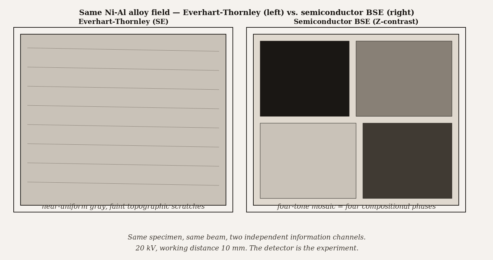
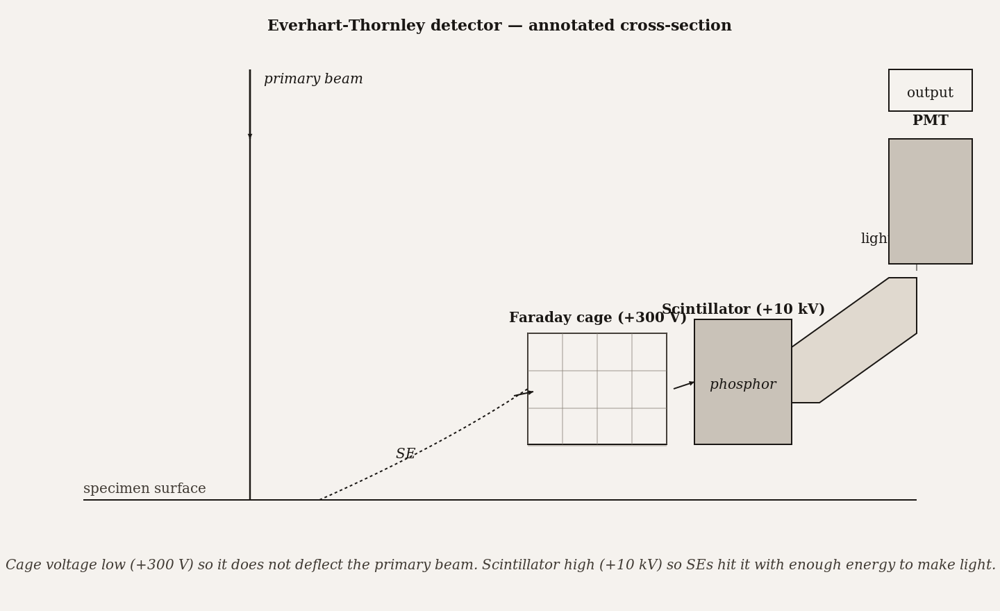
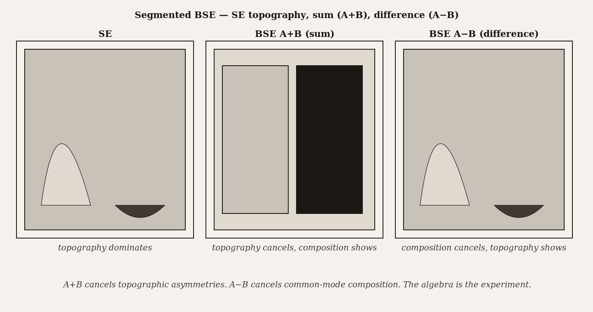

# Chapter 7 — SEM Detectors and Image Formation

*The specimen did not change. The physics did not change. Only the detector changed — and suddenly there were four phases where before there was one.*

---

A graduate student is at the SEM with a polished nickel-aluminum alloy. The instrument is running at 20 kV. Through the Everhart-Thornley detector, the screen shows a uniform gray surface with faint hints of phase contrast at the scratched edge of the polish. Unremarkable. Then the student switches to the semiconductor backscatter detector mounted under the objective lens. The same field of view becomes a four-tone mosaic: near-black where aluminum dominates, two shades of gray for intermediate phases, near-white where the nickel concentration peaks. Phase boundaries that were invisible a moment ago are now the dominant feature of the image.

Nothing about the specimen changed. The beam energy, the kV, the working distance, the probe size — all identical. What changed is which population of electrons is being counted. The Everhart-Thornley counts mostly secondary electrons, which carry information about surface topography and almost none about atomic number. The backscatter detector counts backscattered electrons, which carry strong atomic-number contrast and very little topographic information. The same specimen, the same physics, two completely different images.

This is the central fact about SEM image formation that the previous three chapters were building toward: an SEM image is not a picture of the specimen. It is a map of signal yield from a particular detector. Until you know which detector made the image, you do not know what the image shows.

*Figure 1.* Same Ni-Al alloy field — Everhart-Thornley (left, near-uniform gray with faint scratches) vs. semiconductor BSE (right, four-tone compositional mosaic).

---

It helps to have a framework for reasoning about any detector, whether you have used it before or not. Every detector, regardless of its specific design, can be characterized by four independent quantities: where it sits (take-off angle), how much of the emission it intercepts (solid angle), which electron energies it responds to (energy response), and how fast it can follow signal changes (bandwidth). The four together define what the detector measures and what it cannot.

**Take-off angle** is measured from the specimen surface to the line connecting the beam impact point to the center of the detector face. A detector directly overhead has a take-off angle near 90° and sees the specimen nearly symmetrically regardless of its tilt. A side-mounted detector at 30° take-off angle sees features on the near side of any surface protrusion brightly and features on the far side dimly — which is why Everhart-Thornley images look like photographs lit from one side. The apparent "illumination direction" in an E-T image is the take-off angle, not a real light source. When operators mistakenly read the shadow direction as the specimen's physical orientation, the error comes from forgetting what take-off angle means.

**Solid angle** is the fraction of the total emission hemisphere the detector face intercepts:

$$
\Omega = \frac{A}{r^2}
$$

where $A$ is the face area and $r$ is the distance from the beam impact point to the detector center. Larger solid angle means more signal collected, better signal-to-noise, shorter required dwell times. A large detector close to the specimen collects aggressively; a small detector far away collects a tiny fraction of the emission. This is not a subtle effect: solid angle scales as $1/r^2$, so doubling the working distance quarters the collected signal. An operator who increases working distance without compensating for the solid-angle loss will wonder why the image went noisy.

**Energy response** is the detector's efficiency as a function of incoming electron energy. This is the parameter that discriminates between detectors most cleanly. Secondary electrons have energies mostly below 50 eV. A bare scintillator crystal cannot be excited by a 5 eV electron — the energy is far below what's needed to emit light from the phosphor. A silicon diode can produce electron-hole pairs, but 5 eV divided by 3.6 eV per pair is barely more than one pair, which drowns in noise. Secondary electrons, left to their own devices, cannot be detected by the simple converters that work beautifully for backscattered electrons. The engineering of SE detectors is entirely a response to this problem.

Backscattered electrons, by contrast, leave the specimen with most of their original beam energy — at 20 kV, BSEs peak around 14–18 keV. That is plenty to excite a scintillator directly, or to generate thousands of electron-hole pairs in silicon. No acceleration needed. BSEs are easy to detect; SEs require a clever solution.

**Bandwidth** is the range of signal frequencies the detector and its electronics can follow. As the beam rasters across a specimen with fine-scale features, the signal alternates rapidly — high spatial frequency translates to high temporal frequency. A detector whose amplifier bandwidth is too narrow smooths over fine detail; a slow detector sees coarse features only. Most modern systems span several decades, but very fast scan rates or very slow integrations can hit bandwidth limits and should be checked.

| Detector | Take-off angle | Solid angle | Energy response | Bandwidth | Primary information |
|---|---|---|---|---|---|
| **Everhart-Thornley (E-T)** | High (above specimen, off-axis ~30–45°) | Medium | Predominantly SE; some BSE leakage | Moderate | Topographic SE imaging — workhorse general-purpose detector |
| **Through-the-lens / in-lens** | On-axis (collected through the objective lens) | Small but very efficient at low kV | Predominantly SE (low-energy) | High | Low-kV high-resolution imaging — surface-sensitive |
| **YAG scintillator BSE** | Above specimen, annular | Large | BSE only (energy threshold typically > 50% of beam) | High | Compositional contrast (Z-contrast); some channeling |
| **Semiconductor (silicon-diode) BSE** | Above specimen, annular | Large | BSE only | Lower (limited by RC time constant of the diode) | Z-contrast at moderate frame rates; common on entry-level SEMs |

---

The Everhart-Thornley detector, designed in 1960, is the solution to the SE detection problem. It is worth understanding mechanically, because its design reveals exactly what the problem required.

Secondary electrons leave the specimen with energies too low to excite a scintillator. The solution is to accelerate them first. A **Faraday cage** — a wire mesh — sits in front of the scintillator and is biased at +300 volts relative to ground. This positive bias attracts low-energy SEs from a wide solid angle around the specimen, pulling them in from nearly the full hemisphere even though the detector is mounted off to the side of the chamber. Once inside the cage, the SEs encounter a second accelerating field: the scintillator face itself is biased at +10 kilovolts, which drives the incoming electrons into the phosphor with enough energy to generate light. The light travels through a glass light guide to a photomultiplier tube, where it triggers an avalanche of amplification — a factor of $10^5$ or more. The final output is a voltage proportional to the number of electrons that entered the cage.

Five components — cage, scintillator, light guide, PMT, amplifier — to solve one problem: how do you measure a 5 eV electron?

The +10 kV on the scintillator would normally destroy the primary beam if it extended into the column, bending electron trajectories unpredictably. The Faraday cage prevents this: the +300 V cage potential perturbs the primary beam negligibly, while shielding the beam from the high-voltage scintillator field. The cage is simultaneously the collector, the shield, and the accelerator — three functions in one wire mesh.

*Figure 2.* Everhart-Thornley detector — Faraday cage (+300 V) attracts SEs without disturbing the primary beam; scintillator (+10 kV) accelerates them into light.

What does the E-T detector actually collect? The answer is messier than the name "secondary electron detector" implies. The +300 V bias attracts SEs broadly, but the E-T detector also intercepts backscattered electrons that happen to enter its solid angle, and it collects a population called SE3 — secondary electrons generated where BSEs strike the chamber walls, the polepiece, and other surfaces at some distance from the specimen. SE3 electrons carry no spatial information about the specimen; they contribute a uniform background. A detailed accounting of an E-T signal on a typical metal specimen shows roughly that SE1 (generated within the primary beam footprint, the high-resolution surface signal) accounts for perhaps a third of the total; SE2 (generated where BSEs exit the specimen, BSE-modulated and lower in lateral resolution) for another fraction; SE3 for a substantial uniform pedestal; and direct BSE interception for a smaller compositional contribution. The E-T is called an SE detector in the same spirit that a city is called quiet: mostly, under typical conditions, but not reliably.

This contamination matters when resolution matters. If SE3 accounts for thirty or forty percent of the total signal, and SE3 carries no spatial information, then a proportional fraction of the image's contrast is background noise smeared uniformly across the frame. The image looks fine at low magnification. At high resolution, the SE3 pedestal limits how much contrast can be extracted from SE1.

---

The solution is through-the-lens detection. In a field-emission SEM with a strong objective lens — the immersion or snorkel geometries described in Chapter 3 — the magnetic field of the objective lens extends down to the specimen and captures secondary electrons generated near the beam impact point. SE1 and SE2 spiral upward along the magnetic field lines, pass through the objective lens, and emerge at the top of the column where a conventional E-T-style detector intercepts them. SE3, generated far from the specimen on chamber walls and polepieces, cannot make it back into the lens field from those distances and is mostly excluded. Direct BSEs, traveling in straight lines, are not captured by the spiral motion and pass through the lens without entering the detector.

The result is a near-pure SE1+SE2 signal. The BSE contamination is suppressed. The SE3 pedestal is suppressed. The image contrast comes predominantly from genuine surface information close to the beam impact point. This is why field-emission SEMs with in-lens detection produce qualitatively sharper images at low voltage than conventional SEMs with side-mounted E-T detectors — it is not only the smaller probe, but the purer signal.

The constraint is working distance. The spiraling capture mechanism requires the lens field to reach the specimen. As working distance increases past the design point of the lens, the field at the specimen weakens, SE collection efficiency drops, and the image goes noisy. A TTL detector at twice its design working distance may be no better than a side-mounted E-T. Operators who push working distance for mechanical clearance — to tilt the specimen, to fit a large stage, to clear a sample with tall features — give up in-lens performance when they do it.

---

Backscattered electrons need no acceleration. They leave the specimen with beam-level energies and can drive a detector directly.

The **YAG scintillator BSE detector** is a crystal of yttrium aluminum garnet, doped with cerium, typically mounted as an annulus around the optic axis directly below the objective. BSEs strike the crystal, excite the cerium dopant, and the crystal emits light — the same scintillator-PMT chain as the E-T, minus the acceleration stage. Because no Faraday cage is needed, no bias field disturbs the primary beam. The detector can sit close to the specimen for a large solid angle.

The **semiconductor BSE detector** is a thin annular silicon diode in the same position. When a BSE strikes silicon, it deposits energy and creates electron-hole pairs at a rate of approximately one pair per 3.6 eV. A 15 keV BSE generates roughly 4,000 free electron-hole pairs in the silicon — a detectable current even before external amplification. The silicon diode is essentially doing its own first-stage gain internally, which gives it good signal levels even at low beam current.

What both detectors see is BSEs only. Secondary electrons arrive at these detectors with energies below 50 eV; the scintillator threshold is far above that, and the semiconductor signal from 50 eV is fewer than 15 electron-hole pairs — invisible above noise. The energy response function does the filtering automatically. No bias voltage selection, no software gate — the detector physics self-selects for BSEs by construction.

The BSE image is a map of BSE coefficient $\eta$, the fraction of primary electrons that backscatter. And $\eta$ depends strongly on atomic number: light elements like carbon ($Z = 6$) have $\eta \approx 0.05$; heavy elements like gold ($Z = 79$) have $\eta \approx 0.50$. A ten-to-one variation across the periodic table translates directly into a ten-to-one variation in BSE image brightness, which is why the Ni-Al alloy that looked uniformly gray through the E-T became a four-tone mosaic through the BSE detector. The phases differ in mean atomic number; the BSE image encodes that difference faithfully.

Topography still contributes a secondary effect in BSE images. A tilted surface presents a different geometry to the incoming beam and a different angular distribution of backscattered electrons, which changes the fraction intercepted by the detector. For qualitative work this is manageable. For quantitative composition mapping it must be corrected or geometrically suppressed.

The suppression method is elegant. A segmented annular BSE detector — four quadrants, or simply two halves A and B — catches BSEs in opposing directions. Reading the **sum** (A + B) gives total BSE yield, which is composition-dominated: topographic asymmetries cancel because whatever geometrical brightening appears in segment A appears as a corresponding dimming in segment B. Reading the **difference** (A − B) gives the asymmetry between the two halves, which is topography-dominated: compositional variations contribute equally to both sides and cancel in the subtraction. One scan, one detector, two images. Experienced operators acquire both routinely.

*Figure 3.* Segmented BSE — sum (A+B) cancels topographic asymmetries (composition shows); difference (A−B) cancels common-mode composition (topography shows). The algebra is the experiment.

---

The practical guidance distills to a simple discipline: before interpreting any SEM image, name the detector.

An SEM image labeled only "SEM micrograph" is ambiguous in the same way that a scientific measurement labeled only "signal" is ambiguous. Which signal? From which detector? The information content differs fundamentally by detector, and misidentification leads to misinterpretation. A BSE compositional bright spot read as a surface protrusion; a topographic shadow in an E-T image read as a phase boundary; an SE3-dominated image read as a high-resolution surface map — each is a real failure mode, and each follows from forgetting which detector produced the image.

The discipline is simple in principle: always read the methods line. *SE mode, 5 kV, in-lens detector, WD = 4 mm* tells you the signal is near-pure SE1+SE2, that the interaction volume is shallow, that depth-of-field will be large, and that compositional contrast will be weak. *BSE detector, 20 kV, sum mode, WD = 8 mm* tells you composition is the dominant contrast and topography is suppressed. The methods line is not a formality. It is the key to reading the image.

For producing images, the discipline runs in the other direction: start with the question, derive the detector. A question about surface morphology at nanometer scale routes to the in-lens at low kV. A question about compositional phase distribution routes to the BSE annulus in sum mode. A question about both simultaneously routes to a simultaneous SE + BSE acquisition, which most modern instruments support in one scan pass. A question about whether a bright feature is topographic or compositional routes to BSE difference mode.

<!-- → [INFOGRAPHIC: decision tree for detector selection — root: "What does your question ask?"; branch 1: surface morphology, nanometer scale → in-lens / TTL, low kV, short WD; branch 2: surface morphology, any WD / large sample → Everhart-Thornley; branch 3: compositional phase mapping → BSE annular, sum mode, 15–25 kV; branch 4: topography of rough surface with composition suppressed → BSE difference mode; branch 5: both composition and topography simultaneously → simultaneous SE + BSE acquisition; branch 6: elemental identity → EDS (Chapter 9); terminal nodes name the detector and key operating condition] -->

---

The feature of all this that I find most striking is how much information lives in the same specimen, invisible until the right detector makes it visible. The four-phase alloy was always four phases. The BSE detector did not create the phase boundaries; it revealed them by measuring a physical quantity — BSE yield — that the E-T was insensitive to. The specimen carries many signals simultaneously. The column delivers them all at once. The detectors are the filters that let you read one signal at a time, or in combinations, depending on what you need to know.

The operator who understands this is not just running the instrument. They are choosing which physical quantity to measure, knowing what that choice reveals and what it hides. Chapter 8 will show how those choices interact with specimen preparation — how the coating you apply, the fixation protocol you use, and the section thickness you cut all interact with the detector physics you have just learned. And Chapter 9 opens the third major detector family: energy-dispersive spectroscopy, which makes the characteristic X-ray signal legible as elemental identity. The interaction volume produces SE, BSE, and X-rays simultaneously. Each has its detector, its resolution, its artifacts. This chapter gave you the first two.

---

## Exercises

### Warm-up

**7.1** — Name the four framework questions used to characterize any SEM detector. For each, write one sentence stating what it controls about the image. *(Tests: four-question framework recall. Difficulty: easy.)*

**7.2** — An E-T detector is mounted at 30° take-off angle. A specimen is tilted 35° toward the detector. Predict qualitatively what happens to the collected SE signal and explain why in terms of take-off angle geometry. *(Tests: take-off angle and tilt interaction. Difficulty: easy.)*

**7.3** — You are looking at a BSE image and see a bright region on what appears to be a flat, polished surface. Give two distinct physical explanations for the brightness — one compositional, one topographic — and state one additional measurement that would distinguish between them. *(Tests: BSE contrast mechanisms. Difficulty: easy.)*

### Application

**7.4** — An E-T detector has a face area of 2 cm² and is mounted 15 mm from the beam impact point. A second session moves the working distance to 25 mm with the detector position fixed relative to the column. Calculate the solid angle at each working distance and find the ratio of collected signal between the two sessions, assuming all else equal. *(Tests: solid angle calculation and $1/r^2$ scaling. Difficulty: medium.)*

**7.5** — A field-emission SEM has an in-lens detector optimized for WD = 4 mm and an E-T detector that works at any WD. A researcher needs to image a biological specimen on a stub with tall features requiring WD = 12 mm. Which detector is appropriate and why? What would the researcher sacrifice by using the other detector at this WD? *(Tests: TTL working-distance constraint vs. E-T flexibility. Difficulty: medium.)*

**7.6** — You are imaging a polished steel alloy with a segmented BSE detector. In sum mode (A+B), you see bright and dark regions correlating with two phases. In difference mode (A−B), you see bright ridges at grain boundaries and dark flat interiors. Interpret what each image shows physically, and explain why the grain-boundary ridges appear in difference mode but not sum mode. *(Tests: sum vs. difference mode contrast logic. Difficulty: medium.)*

**7.7** — A semiconductor BSE detector in silicon has a threshold of about 3.6 eV per electron-hole pair. The beam is at 10 kV and the BSE coefficient is $\eta = 0.25$. The beam current is 500 pA and the detector solid angle subtends 8% of the hemisphere. Estimate: (a) the BSE current incident on the detector, and (b) the e-h pair generation rate in the silicon per second. *(Tests: BSE signal current calculation and semiconductor gain. Difficulty: medium.)*

### Synthesis

**7.8** — A materials scientist is characterizing a thin-film solar cell stack: a glass substrate, a transparent conducting oxide layer (~200 nm), an absorber layer (~2 μm), and a back contact metal. She wants (a) a cross-section image resolving all four layers, (b) a map showing whether the absorber layer composition is uniform across a 100 μm width, and (c) identification of any metallic inclusions larger than ~50 nm in the absorber. For each goal, specify the detector, the approximate kV, and one artifact or limitation specific to that measurement on this specimen geometry. *(Tests: detector selection + operating conditions + artifact awareness integrated across a layered specimen. Difficulty: hard.)*

**7.9** — A classmate argues that the E-T detector is always preferable to the in-lens because it works at any working distance and collects more total signal. Write a rebuttal of two to three paragraphs. Your argument must address: what populations contaminate the E-T signal and what those populations cost in image quality, under what specific conditions the in-lens is clearly superior, and what the operator actually gives up by using the in-lens at short working distance. *(Tests: nuanced comparison of E-T vs. TTL across signal purity, WD constraints, and resolution. Difficulty: hard.)*

### Challenge

**7.10** — Find a published SEM figure in your field where the detector type is specified in the methods section. Read the methods line carefully. Based on what this chapter taught about that detector, predict one feature or artifact you would expect to see in the image — and check whether it is there. Then write one sentence describing what you would expect to see differently if the authors had used the other major detector type (SE → BSE or BSE → SE) for the same specimen and operating conditions. *(Difficulty: open-ended.)*

---

 evidence that a single detector geometry could simultaneously deliver SE-quality surface resolution and BSE-quality Z-contrast on routine samples without any signal mixing or trade-off. Modern energy-discriminating annular detectors are pushing in this direction. The four constraints of Section 2 — take-off angle, solid angle, energy response, bandwidth — still form a joint constraint surface that no current instrument fully escapes.

**Still puzzling:** the SE3 contribution to E-T signal varies substantially across instruments and chamber geometries depending on chamber material, polepiece geometry, and nearby detector hardware, yet is almost never characterized for a specific instrument. The instrument-to-instrument variation means that "E-T detector" does not specify a measurement with precision — which makes quantitative comparison between SEMs using the same nominal detector type harder than it should be.

