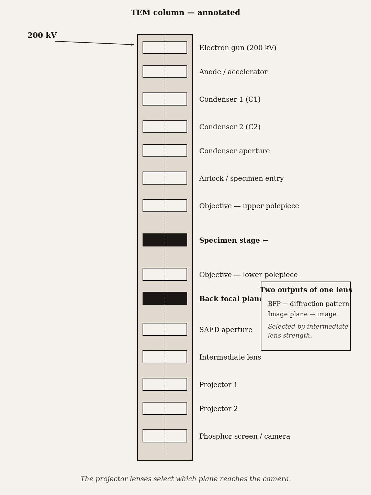
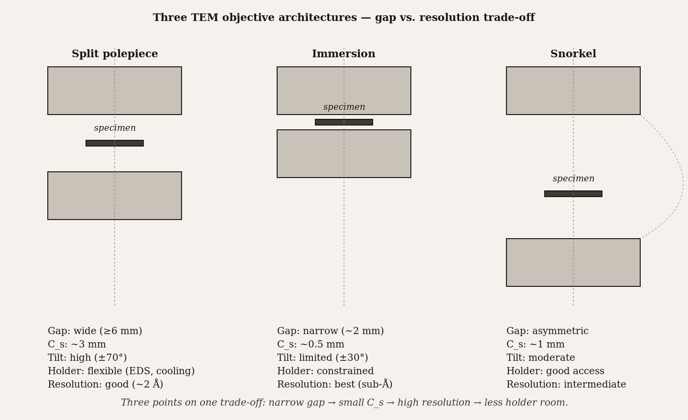
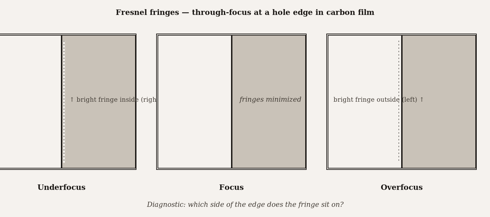

# Chapter 13 — TEM Instrument Design and Operation

*The image you see at 50,000 magnifications is the end of a chain of coordinated decisions — and the weakest link is always the objective lens.*

---

A graduate student picks up a copper grid with a pair of sharp tweezers. The grid is three millimeters in diameter, thin enough that a breath can flip it across the bench. On it, resting on an amorphous-carbon support film, is a single 70-nanometer-thick section of stained biological tissue — the product of two days of fixation, dehydration, embedding, and ultramicrotome cutting. The student loads the grid into the tip of a long metal rod called a holder, slides the holder into a small side chamber called an airlock, pumps for thirty seconds, then rotates the holder into the column. A click. A green light. An image appears on the screen.

Behind that apparently simple sequence sits an instrument running at 200,000 volts, with two condenser lenses to shape and aim the illuminating beam, a strong objective lens that immerses the specimen in its magnetic field, three or four post-specimen lenses that magnify the result by millions, a vacuum system holding the column at $10^{-7}$ pascals from gun to camera, and a detector that converts the electron distribution into pixels thirty times a second. The student needed to know almost none of this to load the grid. To understand the image — to know when the image is trustworthy and when it is an artifact, to know how to make it sharper or how to switch from imaging to diffraction without losing the specimen — the student needs to know all of it.

This chapter is that knowledge.

*Figure 1.* TEM column — annotated cross-section. Two outputs of the objective lens: a diffraction pattern at the back focal plane and an image at the image plane.

---

The TEM column is, architecturally, an inverted optical microscope with electrons in place of light. The lamp is at the top; the condenser lenses shape the illumination; the specimen sits in the objective lens; post-objective lenses project the magnified image onto a detector at the bottom. Every major component has an optical analog. The differences are in the physics of the electron beam, the engineering required to maintain vacuum, and the fact that the lenses are electromagnets rather than ground glass.

Start at the top with the **electron gun**. There are four families, and the differences between them matter enormously for TEM performance. A tungsten thermionic gun heats a hairpin wire to 2,700 K until electrons boil off. It works, it is cheap, it tolerates rough vacuum ($10^{-2}$ Pa), and it lasts about 100 hours before the filament burns through. The source is large — the effective crossover diameter is larger than 100 micrometers — which limits how tightly the beam can be focused and how spatially coherent the illumination is. A lanthanum hexaboride (LaB$_6$) gun operates at 1,700 K on a crystal with a lower work function, giving a brightness roughly 50 times higher and a source size of about 10 micrometers. Most biological TEM for the last few decades ran on LaB$_6$.

For high-resolution work, neither thermionic source is adequate. The solution is field emission: apply an enormous electric field at a very sharp tip, pulling electrons out by quantum tunneling rather than thermal agitation. A cold field-emission gun operates at room temperature, has a virtual source size of about 3 nanometers, and produces brightness roughly 1,000 times higher than LaB$_6$ with an energy spread of only 0.3 eV. The energy spread matters because electrons of slightly different energies are focused at slightly different distances by the objective lens — **chromatic aberration** — and a gun with a narrow energy spread produces sharper images. The cost of a cold FEG is demanding vacuum requirements ($10^{-9}$ Pa) and periodic flashing of the tip to remove adsorbed gas. The Schottky FEG splits the difference: a thermally assisted field-emission source at 1,700 K, with a source size of about 15 nanometers, vacuum requirements of $10^{-6}$ Pa, and brightness between cold FEG and LaB$_6$. Essentially all modern high-resolution TEMs use Schottky or cold FEG sources.

The gun's job is to produce electrons with a controlled energy and a small, bright source. Everything downstream works with what the gun provides. A weak gun cannot be compensated by better lenses. This is the same lesson as in the SEM column, and it is equally true here.

| Source | Source size | Brightness at 100 kV (A/m²·sr) | Energy spread ΔE | Vacuum required | Lifetime |
|---|---|---|---|---|---|
| **Tungsten (W)** | ~50 μm | ~10⁹ | 2–3 eV | 10⁻³ Pa | 50–100 hours |
| **LaB₆** | ~10 μm | ~10¹⁰ | 1–2 eV | 10⁻⁵ Pa | 500–1000 hours |
| **Schottky FEG** | ~30 nm (virtual) | ~10¹² | 0.6–1.0 eV | 10⁻⁷ Pa | ~5,000 hours |
| **Cold FEG** | ~5 nm (virtual) | ~10¹³ | 0.2–0.4 eV | 10⁻⁹ Pa (UHV) | ~10,000 hours (with periodic flashing) |

*Order-of-magnitude jumps in brightness as you move from thermionic to field-emission, paid for in vacuum demand and cost.*

---

The **condenser lenses** — two of them, C1 and C2 — take the source crossover and demagnify it toward the specimen. C1 (often labeled "spot size" on the control panel) sets the minimum illuminated spot. C2 (often labeled "brightness") controls how broadly the beam is spread across the specimen in the final imaging condition. Together they give independent control over spot size and beam intensity, which matters because different TEM modes need different illumination geometries: high-resolution imaging wants tight, coherent illumination on a small region; a survey of a large biological section wants a broad, uniform flood across many micrometers. A condenser aperture intercepts off-axis electrons that would add aberration without contributing useful signal.

The illumination system is relatively straightforward compared to what comes after the specimen. Its job is to deliver electrons to the specimen in a controlled way. The complexity lives in the objective lens.

---

The **objective lens** is the most important component in the TEM. It is the lens that forms the first image of the specimen — everything else downstream is magnification of that first image — and it is where the dominant resolution-limiting aberrations live. The objective lens determines what the TEM can see.

The lens is a solenoid wound around a gap in a soft-iron polepiece. The gap is narrow — a few millimeters — and the specimen sits inside it, immersed in the strong magnetic field. The field focuses the transmitted electrons into an image at the objective image plane. Simultaneously, in the back focal plane of the objective, the transmitted electrons organize into a **diffraction pattern** — the Fourier transform of the specimen's scattering. One lens, two planes, two different kinds of information: images in the image plane, diffraction patterns in the back focal plane. Which of these the operator sees on the screen is controlled by the intermediate lenses below.

The central engineering challenge of the objective lens is spherical aberration, introduced in Chapter 2. In any rotationally symmetric electromagnetic lens, electrons traveling off-axis are focused too strongly; the focal "point" becomes a disk of confusion whose radius scales as $C_s \alpha^3$, where $C_s$ is the spherical aberration coefficient and $\alpha$ is the beam half-angle. Reducing $C_s$ requires a very short focal length, which requires a very strong lens field, which requires a very narrow polepiece gap — and a narrow gap leaves little room for the specimen and its holder. The objective lens design is one long negotiation between resolution and specimen access.

Three architectures exist for this negotiation. In the **split polepiece** design, the upper and lower polepiece are separated with a gap large enough for the specimen holder to tilt ±60° and for various holder types — heating, cooling, straining, tomography — to be inserted. The gap is also large enough for an energy-dispersive X-ray detector to have line-of-sight to the specimen for analytical work. Resolution is good: $C_s$ of roughly 1 millimeter on a modern uncorrected instrument. This is the versatile choice, and most general-purpose TEMs use it.

In the **immersion** design, the specimen drops into the center of the lens field through a very narrow bore. The gap is minimized, the focal length is short, $C_s$ is low, and resolution is pushed toward the fundamental limit. The cost is severe: few holder geometries can fit; X-ray detectors cannot get close; tilt range is restricted. Immersion objectives appear in specialized high-resolution instruments where analytical flexibility is explicitly sacrificed for image resolution.

The **snorkel** design is a single polepiece with an asymmetric field. It captures more of the benefit of immersion while recovering some of the holder access of the split polepiece. Modern aberration-corrected TEMs — where hardware correctors in the post-objective optics compensate $C_s$ in software — use snorkel or modified-immersion geometries because the aberration corrector removes the resolution penalty of a longer focal length, and the operator regains specimen flexibility.

*Figure 2.* Three TEM objective architectures — three points on a gap-width vs. resolution trade-off continuum.

The **objective aperture** sits at the back focal plane, where the diffraction pattern forms. Its position in the diffraction plane means it selects which scattered beams contribute to the image. Place the aperture around only the direct (unscattered) beam and you get a **bright-field** image, where scattered regions appear dark. Move the aperture to surround a single off-axis diffracted beam and you get a **dark-field** image, where only the planes that produced that reflection appear bright. Remove the aperture entirely — or use a very large one — and many diffracted beams interfere at the image plane to produce **phase contrast**: lattice fringes and ultimately atomic-resolution images. Chapter 14 develops bright-field and dark-field in detail; Chapter 16 develops phase contrast. For now: the objective aperture is the switch between modes, and its physical position in the column is the back focal plane of the objective lens.

---

Below the objective, the **post-specimen optics** — intermediate lens and one or two projector lenses — cascade the image to higher magnification and project it onto the camera or viewing screen.

The intermediate lens has a mode-switching function. In imaging mode, it is excited to project the objective's image plane onto the next stage. In diffraction mode, its excitation is changed so that it projects the objective's back focal plane instead — the diffraction pattern rather than the image. The hardware is the same; the lens current is different. This is why switching between imaging and diffraction requires only a button press: the button changes the intermediate lens current.

For diffraction on a specific region — a single grain in a polycrystalline sample, a specific organelle in a cell — the operator inserts a **selected-area aperture** at an intermediate image plane. The aperture casts a shadow that restricts which part of the specimen contributes to the diffraction pattern. This is **selected-area electron diffraction** (SAED), covered in Chapter 15.

The projector lenses complete the cascade. Older instruments had three projectors; modern ones typically have two. Their excitations are ganged to the magnification control: turning the magnification knob re-excites the projectors to change the final magnification on the camera.

---

The specimen enters the column through the **airlock**. The column lives at $10^{-7}$ pascals; the laboratory lives at $10^5$ pascals. Exposing the column to atmosphere — to pump down from $10^5$ to $10^{-7}$ — would take hours and would contaminate the column with water vapor and hydrocarbons that are extremely difficult to remove at TEM operating pressures. The airlock is a small side chamber that bridges the pressure gap. The holder enters the airlock at atmosphere; the airlock pumps to approximately $10^{-3}$ pascals in thirty to sixty seconds using a scroll or rotary pump; a valve opens to the column; the holder slides in. The main column vacuum is only momentarily exposed to $10^{-3}$ pascals, not atmosphere. The pressure ratio across the main valve is a factor of $10^4$ rather than $10^{12}$.

The specimen inside the holder is a three-millimeter grid. The grid is a metal mesh — copper, nickel, gold — that holds a thin support film (amorphous carbon or formvar) across its holes. The specimen section or nanoparticles or whatever is being imaged rests on the support film. The electron beam passes through the holes in the grid and through the support film and specimen; the solid metal of the grid bars is opaque to the beam and simply blocks those areas of the image. Grid mesh density (expressed as the number of wires per inch — 200 mesh, 300 mesh, 400 mesh) sets the trade-off between how much specimen is viewable per grid square versus how well the support film is held flat.

The holder positions the grid at the **eucentric plane** of the stage: the specific height at which tilting the stage rotates the specimen in place rather than translating it laterally. If the specimen is not at eucentric height and the operator tilts the stage, the field of view shifts — the feature being examined walks off-screen. For tomography (Chapter 19), where dozens of images are taken at systematically varied tilt angles around the same region, the specimen must be at eucentric height precisely and consistently. The operator finds eucentric height by tilting the stage back and forth by a few degrees while adjusting the z-height until the feature stops drifting laterally with tilt. It is a step that experienced operators do automatically and new operators often forget, and forgetting it ruins tilt series.

---

At the bottom of the column is the **detection system**. For decades, TEM images were recorded on photographic film, then on film with fluorescent scintillators, then on **charge-coupled device** cameras. A CCD camera converts incoming electrons to light in a scintillator (typically a YAG crystal), couples the light to the CCD sensor via a fiber-optic plate, and reads out the charge. The CCD architecture gives good dynamic range and has been the standard for digital TEM for twenty years. Its limitation is the scintillator: light spreads laterally in the crystal before reaching the sensor, blurring fine detail at the pixel level, and the multi-step conversion (electron to photon to charge) adds noise at each stage.

**Direct-electron-detection cameras** eliminate the scintillator. Electrons hit a thin silicon sensor directly, generating charge that is read out without the intermediate photon conversion. The result is less lateral spread, less added noise, and faster readout rates — modern DEDs run at hundreds of frames per second, fast enough to record movies of specimens and then computationally correct for beam-induced motion during exposure. This last capability is what transformed cryo-EM single-particle reconstruction: specimens move slightly during the electron beam's exposure, and that motion blurs the image. A DED fast enough to record many frames per exposure allows post-hoc alignment that corrects the motion before summing the frames. The resolution improvements achievable by DED over CCD for cryo-EM single-particle work are so large that essentially all modern cryo-EM targeting sub-nanometer resolution uses DEDs. Chapter 21 covers this in detail.

For routine biological imaging at moderate resolution, CCD or CMOS cameras are still standard. For high-resolution work where every fraction of a nanometer matters, a DED is no longer a luxury.

<!-- → [INFOGRAPHIC: camera technology evolution — four panels in sequence: (1) phosphor screen (eye only, no digital); (2) CCD (scintillator → fiber optic → CCD sensor, annotation showing lateral spread and noise steps); (3) CMOS (same architecture, annotation showing faster readout, reduced pixel bleeding); (4) Direct electron detector (electron → thin Si sensor directly, annotation showing eliminated spread, lowest noise, high frame rate enabling motion correction); arrow timeline from left to right; each panel labels approximate resolution limit and frame rate; student should see the signal path simplification as the technology progresses] -->

---

The operator's most immediate task at the instrument is focus. In an optical microscope, you focus by moving the objective lens or the stage until the image is sharp to the eye. In a TEM, focus is set by adjusting the current to the objective lens: a stronger current brings the image plane higher in the column, a weaker current lowers it, and at the right current the image plane coincides with the detector surface.

The diagnostic for focus is **Fresnel fringes**. At any sharp edge in the specimen — the boundary of a hole in the support film, the edge of a nanoparticle — diffraction between the electron wave passing through the edge and the wave bypassing it produces interference fringes: alternating light and dark stripes parallel to the edge. These fringes are exquisitely sensitive to focus. When the objective is underfocused (current too weak), the bright fringe is inside the edge, toward the specimen. When overfocused (current too strong), the bright fringe is outside, away from the specimen. At exact focus, the fringes minimize. An experienced TEM operator focuses by watching the Fresnel fringes at a clean edge — defocusing deliberately in both directions to establish orientation, then converging on the minimum-fringe in-focus condition. It is faster and more reliable than trying to judge sharpness of the specimen features themselves, which can be ambiguous at the spatial frequencies of interest for high-resolution work.

Astigmatism — differential focus in perpendicular directions, caused by non-circular symmetry of the lens field — shows up as Fresnel fringes that are focused in one orientation but not the perpendicular one. The correction is the stigmator: a set of small octupole coils that add a compensating asymmetry to the lens field to restore circular symmetry. The focus-stigmator alignment cycle is the same procedure as in the SEM (Chapter 2), adapted to the TEM's through-focus diagnostic.

*Figure 3.* Fresnel fringes at a hole edge — through-focus diagnostic. Which side of the edge does the fringe sit on?

---

It is worth standing back and appreciating what the TEM is doing. The specimen is a 70-nanometer slab of biological tissue, thin enough to be partially transparent to 200 keV electrons. The electron beam passes through it, is scattered differently by different parts of the specimen — more scattered by dense stained regions, less by the surrounding resin — and the objective lens reorganizes those scattered electrons into a real image at the objective image plane. The intermediate and projector lenses then magnify that image by a factor of thousands onto the camera. A final image at 50,000 magnifications represents a spot on the specimen roughly 300 nanometers across expanded to fill a camera sensor that is centimeters wide: a factor of 30 million in linear dimension. Every nanometer of detail in the original specimen has been enlarged to 30 micrometers on the sensor — large enough for the camera pixels to record it faithfully.

For this to work, the entire column must hold its alignment to within nanometers while the image is being acquired. Thermal drift of the column distorts that alignment; mechanical vibration in the building does the same. Modern TEM facilities spend enormous effort isolating the instruments from vibration and thermal gradients. The operator's contribution is patience: after inserting a new specimen, the system needs time — five to fifteen minutes — to reach thermal equilibrium before the drift settles to a level low enough for publication-quality acquisition.

Chapter 14 now takes the column you have just learned and asks: what exactly does a bright-field image show, and why do some regions appear dark and others light? The objective aperture, the diffraction pattern it intercepts, and the physics of electron scattering in the specimen are the machinery that answers that question.

---

## Exercises

### Warm-up

**13.1** — List the six major subsystems of a TEM column in top-to-bottom order and give one sentence per subsystem describing its function. *(Tests: column architecture recall. Difficulty: easy.)*

**13.2** — Explain in two sentences why a cold field-emission gun produces sharper TEM images than a tungsten thermionic gun, without using the words "brightness" or "coherence." *(Tests: source size, energy spread, and their image consequences. Difficulty: easy.)*

**13.3** — You are looking at a hole in the support film of a TEM specimen. The bright Fresnel fringe is outside the edge, away from the specimen. Is the objective lens over- or underfocused? What knob adjustment corrects it? *(Tests: Fresnel fringe focus diagnostic. Difficulty: easy.)*

### Application

**13.4** — A researcher is designing a TEM experiment that requires (a) atomic-resolution HRTEM imaging of a silicon crystal, and (b) simultaneous EDS elemental mapping of a precipitate within the crystal. She must choose between an immersion objective lens and a split-polepiece objective lens. Which architecture serves each goal, and which would you recommend for the combined experiment? Justify in terms of $C_s$, polepiece gap, and detector geometry. *(Tests: objective lens architecture trade-offs applied to a real experimental constraint. Difficulty: medium.)*

**13.5** — A TEM operator needs to acquire a selected-area electron diffraction pattern from a single 500 nm grain in a polycrystalline ceramic. Walk through the mode-switching procedure step by step, naming which lens excitation changes, which aperture is inserted, and what the operator sees on the screen at each step. *(Tests: SAED mode-switching mechanics and hardware mapping. Difficulty: medium.)*

**13.6** — A new TEM holder is inserted through the airlock. The airlock pumps for 45 seconds and the green indicator lights. Two minutes into the session, the image at 100,000× shows a feature that drifts steadily across the screen. Name the most likely cause, explain the physics behind it, and state how long the operator should wait before acquisition. *(Tests: thermal drift, equilibration time, and vacuum/contamination awareness. Difficulty: medium.)*

**13.7** — A TEM image of a 70 nm biological section is acquired at 50,000× on a camera with a 25 mm sensor edge. What area of the specimen does the image cover? If the camera has 4096 pixels along that edge, what is the pixel sampling in nanometers per pixel at the specimen? Is this sufficient to resolve 1 nm features according to the Nyquist criterion? *(Tests: magnification arithmetic and sampling calculation. Difficulty: medium.)*

### Synthesis

**13.8** — A cryo-EM facility is deciding between upgrading from a CCD camera to a direct-electron-detection camera for single-particle reconstruction work. The target resolution is 0.3 nm. Write a two-paragraph argument for the upgrade that addresses: (a) why the CCD's scintillator-based architecture limits resolution at this target, and (b) why the DED's frame-rate capability specifically enables the motion-correction step that makes 0.3 nm resolution achievable. *(Tests: camera architecture physics integrated with cryo-EM methodology. Difficulty: hard.)*

**13.9** — A graduate student is beginning a tomography experiment (Chapter 19 preview). They need to acquire 61 images of the same region at tilt angles from −60° to +60° in 2° increments. (a) Explain why eucentric height is essential for this experiment and what goes wrong if it is not set. (b) After setting eucentric height, the student tilts to +30° and finds the feature has drifted slightly off-center. Describe what this indicates and how to correct it. (c) Between each tilt, the stage needs time to settle before acquisition. What physical process requires this settling time? *(Tests: eucentric height mechanics, tilt-series discipline, and drift physics integrated across the specimen-manipulation system. Difficulty: hard.)*

### Challenge

**13.10** — Find a published TEM paper in your field that reports the gun type, accelerating voltage, objective lens type, and camera used. For each of the four reported parameters, identify one specific consequence for image quality that follows from this chapter's physics. Then identify one parameter that the authors did not report but that would affect your ability to judge whether the instrument was properly configured for their claimed resolution. *(Difficulty: open-ended.)*

---

 evidence that direct-electron-detection cameras can be replaced by scintillator-based architectures without sacrificing the resolution improvements that made cryo-EM single-particle reconstruction transformative. Current evidence consistently shows DEDs are decisive for sub-half-nanometer cryo-EM work; the motion-correction capability alone is not replicable with a slow-readout camera.

**Still puzzling:** the trade-off between immersion and split-polepiece objective lens designs is genuinely hard to optimize across all use cases, and the introduction of aberration correctors changes the trade-off without eliminating it. Most labs choose an objective-lens architecture once, when they buy the instrument, and commit to it for fifteen years. Whether that match between instrument design and evolving science stays optimal over the instrument's lifetime is a question almost no one asks explicitly before writing the purchase order.

