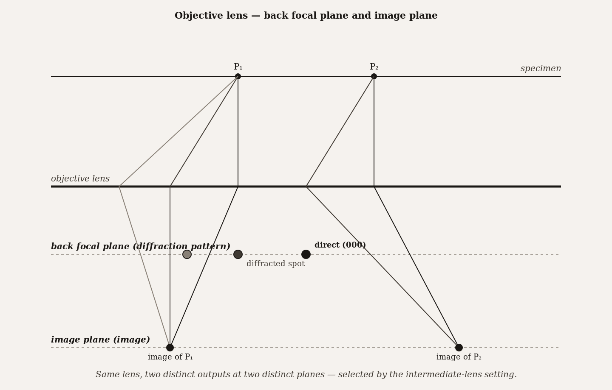
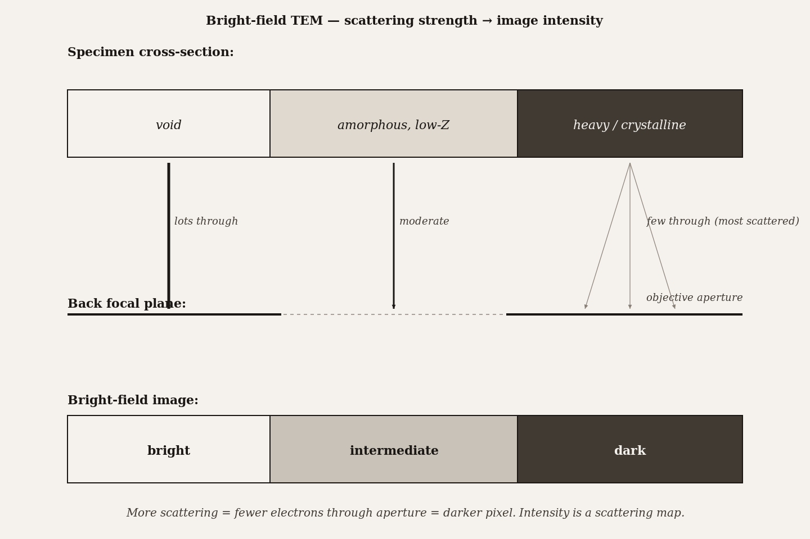
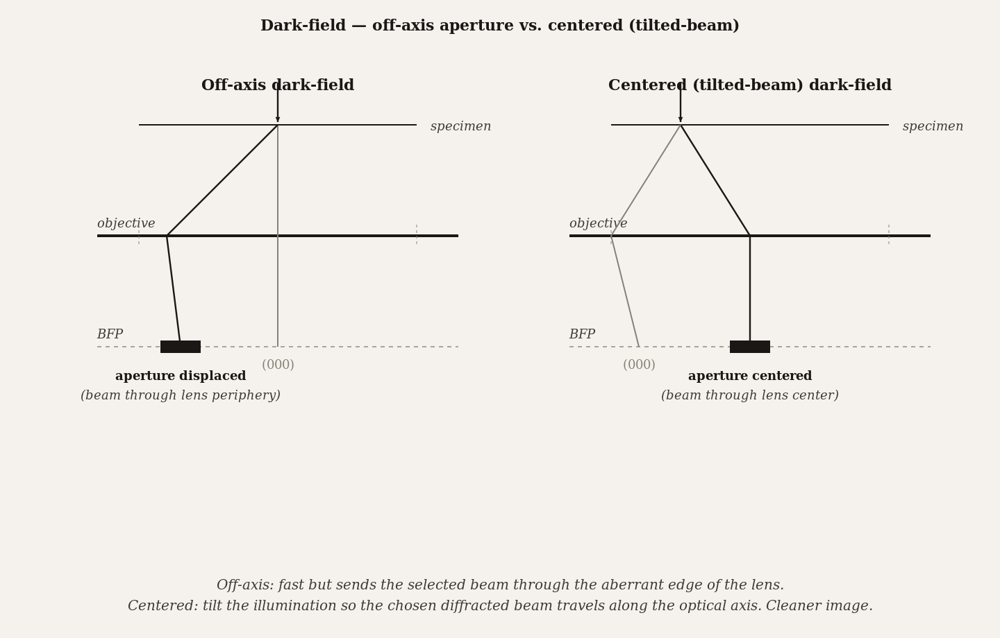

# Chapter 14 — Image Formation in TEM

*The same specimen produces different images in bright-field and dark-field because the objective aperture is deciding which electrons are allowed to tell their story.*

---

A graduate student is at the TEM looking at a thin foil of polycrystalline aluminum. The image at 50,000× shows a nearly uniform gray field — grain boundaries barely visible, defects invisible. The student inserts the objective aperture and centers it on the direct beam. The image transforms: grains sharpen into distinct gray levels, dark contours appear that mark dislocations, grain boundaries resolve cleanly. Now the student tilts the aperture to surround a single diffracted beam instead of the direct beam. The image inverts. What was bright is dark. What was dark is bright. Some grains light up; others go black. The dislocations that appeared as dark lines are now bright lines against a dark background.

Same specimen. Same accelerating voltage. Same magnification. Nothing physical changed except which electrons were allowed to contribute to the image.

That is the whole of this chapter. Once you understand what the objective aperture is selecting — and why the different selections give radically different images from the same physical object — you can read any TEM image critically. Bright-field, dark-field, and high-resolution phase contrast are not three different instruments. They are three aperture configurations on the same instrument, three different answers to the question: of all the electrons that passed through the specimen, which ones are we letting form the image?

---

To understand the aperture's role, you need to understand how the TEM forms an image in the first place. The process has two stages, and most of the confusion about TEM imaging comes from not keeping the two stages clearly separated.

In the first stage, the electron beam strikes the specimen. Some electrons pass straight through without any interaction — these are the **direct beam**, the unscattered electrons. Others scatter elastically at specific angles determined by the crystal structure of the specimen, producing a pattern of discrete beams called **diffracted beams**. Still others scatter at larger angles, lose energy in inelastic events, or scatter diffusely. All of these electrons — direct, diffracted, and scattered in various directions — then pass through the objective lens.

Here is the crucial thing about a lens: it does two distinct things at two distinct planes below it. At the **back focal plane**, which sits at one focal length below the lens, all rays that were parallel when they entered the lens — meaning all electrons scattered at the same angle — converge to the same point. The result is a **diffraction pattern**: a map of scattering directions, where each spot corresponds to a particular beam direction. For a crystalline specimen, this pattern is a set of sharp spots arranged according to the crystal's symmetry. For an amorphous specimen, it is a set of diffuse rings.

At a different plane, farther below the lens, something else happens: all the electrons that originated from the same point on the specimen converge back together, regardless of what angle they scattered through. This is the **image plane**, and it contains a magnified image of the specimen.

*Figure 1.* Objective lens — same lens, two distinct outputs. Direct + diffracted beams from one specimen point converge at the image plane; parallel beams from different points converge at the back focal plane.

The same lens produces both outputs — a diffraction pattern and an image — simultaneously, at different distances below it. The operator selects which output to project onto the camera by adjusting the strength of the intermediate lens. When the intermediate lens focuses on the back focal plane, you see the diffraction pattern. When it focuses on the image plane, you see the image. The ability to switch between these two modes at the press of a button — to go from an image of a grain to the diffraction pattern of the same grain and back — is one of the distinctive powers of the TEM.

---

Now the objective aperture enters, and this is where the choice that determines everything gets made.

The objective aperture is a thin metal disk with a small hole, inserted at the back focal plane. Because the back focal plane is where the diffraction pattern forms, the aperture can selectively block specific beams. If you center the aperture's hole on the direct beam, only the direct beam passes through to form the image. All the scattered beams are physically blocked. This is **bright-field imaging**.

What does a bright-field image show? The direct beam is the beam that was *not* scattered. Any part of the specimen that scatters electrons strongly will send fewer electrons into the direct beam — those electrons went sideways, into the diffracted directions, and got blocked by the aperture. So regions that scatter strongly appear dark in the image, because they depleted the direct beam. Regions that scatter weakly appear bright. Voids and holes in the specimen appear brightest of all, because nothing is there to scatter anything.

The practical consequences are worth spelling out. Thicker regions of the specimen appear darker in bright-field because the electron path through more material means more scattering events. Regions with higher atomic number appear darker because heavier atoms scatter electrons more strongly. Crystalline regions appear darker when they are oriented at an angle that produces strong diffraction — the Bragg condition — because diffraction is just organized, coherent scattering. And because all of these effects contribute simultaneously to the image, interpreting a bright-field image is not always straightforward: a dark region could be thick, or heavy, or crystalline in a particular orientation, or some combination.

*Figure 2.* Bright-field intensity is a scattering map. Void → bright (most through). Light-Z amorphous → intermediate. Heavy / crystalline → dark (most scattered out by the aperture).

The contrast in such an image is defined quantitatively as

$$C = \frac{\Delta I}{I}$$

the fractional difference in intensity between adjacent regions. A region that is 10% darker than its neighbor has a contrast of 0.10. Below about 5%, features become difficult to see by eye in noisy data; above 15%, boundaries are clear and unambiguous. The size of the aperture matters here. A smaller aperture excludes more of the scattered electrons, improving contrast. But a smaller aperture also admits fewer electrons through to the camera, which means the image is dimmer and requires either longer acquisition time or higher beam current. There is no free lunch: smaller aperture, more contrast, less current.

---

The inversion of bright-field imaging is immediate once you understand the mechanism. In **dark-field imaging**, the aperture is configured so that the direct beam is blocked and only one or more scattered beams pass through. The image is now formed by electrons that *were* scattered in a specific direction. The result is a perfect inversion of the bright-field logic: regions that scatter strongly into the chosen direction appear bright; regions that do not appear dark; the background — the matrix, the vacuum — is black.

There are two ways to achieve dark-field operationally. The simpler is to displace the aperture off-axis to surround a specific diffracted spot, while the illumination stays on-axis. This works but produces slightly degraded image quality because the selected beam is traveling off-axis through the lens, which means it experiences more of the lens's aberrations than a beam traveling straight down the optic axis. The better technique is **centered dark-field**: tilt the incident beam so that the diffracted beam of interest is now traveling down the optic axis, then center the aperture on that beam. The selected beam now travels straight through the center of the lens with minimum aberration, giving a sharper image at the cost of some setup time.

*Figure 3.* Off-axis dark-field is fast but sends the selected beam through the lens periphery. Centered DF tilts the illumination so the chosen beam travels along the optical axis.

The power of dark-field comes from its selectivity. Suppose a polycrystalline specimen has grains of several different orientations, and a second-phase precipitate at the grain boundaries. In bright-field, all grains transmit the direct beam to varying degrees, and the precipitates are barely distinguishable from the matrix. But if you move the aperture to surround a diffracted spot that comes specifically from the precipitate's crystal structure — a spot that appears only when the precipitate diffracts, not when the matrix diffracts — then the dark-field image lights up only the precipitates. Everything else is dark. The population of precipitates, their size, their distribution, their density at grain boundaries: all of this becomes visible in a way that the bright-field image could not show.

This is the reason experienced TEM operators think in terms of aperture configuration rather than "mode." The question is not "should I use BF or DF?" The question is "which beam — or which set of beams — contains the information I want?" The aperture is simply the hardware tool for answering that question.

---

There is a third aperture configuration that deserves its own discussion, though the full treatment belongs in Chapter 17. When you remove the objective aperture entirely — or use one so large that it lets all the beams through — something qualitatively different happens. The direct beam and multiple diffracted beams all arrive at the image plane simultaneously. They interfere. The image is no longer an amplitude image — a record of how many electrons passed through each region — but a **phase image**: a record of the interference pattern between all the waves that passed through the specimen. This is **high-resolution TEM**, or HRTEM, and it can show lattice fringes at atomic spacings. The interpretation is more complicated because the image depends on both the specimen's structure and the phase shifts introduced by the lens itself — but the reward is atomic-scale spatial information.

The distinction between amplitude contrast and phase contrast is fundamental. Bright-field and dark-field images are amplitude contrast: they show intensity variations caused by differences in how many electrons reached each pixel. HRTEM images are phase contrast: they show intensity variations caused by differences in the phases of waves that interfered at the camera. A thin, light-element specimen that has almost no amplitude contrast — almost invisible in bright-field — can have strong phase contrast because the atoms shift the electron waves' phases even when they deflect relatively few of them.

| Mode | Aperture position | What reaches the image plane | Contrast mechanism | Bright | Dark | Best used for |
|---|---|---|---|---|---|---|
| **Bright-field (BF)** | Centered on the direct (transmitted) beam | Direct beam + small-angle scattered | Amplitude — strong-scatterers appear dark | Vacuum / weakly-scattering regions | Strong-scatterers (heavy elements, thick regions, defects) | Standard imaging; survey work |
| **Dark-field (off-axis)** | Aperture displaced from optic axis to admit one diffracted beam | A specific diffracted beam only | Amplitude — only regions diffracting *this* beam appear bright | Regions in Bragg condition for selected reflection | Everything else | Defects, dislocations, second phases |
| **Centered dark-field** | Beam tilted so a diffracted beam runs down the optic axis | A specific diffracted beam, axial | Amplitude — but with reduced aberration vs. off-axis DF | Regions diffracting this beam | Everything else | High-quality DF imaging when aberrations matter |
| **HRTEM (no aperture)** | No aperture, or large objective aperture | Direct + multiple diffracted beams interfering | Phase — interference produces lattice fringes | Lattice fringes (alternating bright/dark) | (Phase contrast — no simple bright/dark map) | Atomic-scale imaging of crystals |

---

There is a subtlety about TEM images that easy to miss and important to keep straight: every TEM image is a projection through the full thickness of the specimen. The electron beam does not scan across the surface of a specimen the way the SEM probe does. It passes through, and everything the beam encounters along its path — from the top surface to the bottom — contributes to the image simultaneously. The image is a two-dimensional shadow of a three-dimensional object.

The consequence is projection ambiguity. Suppose you see a circular feature with a bright center and a dark ring in a bright-field image. That looks like a hollow vesicle — a particle with low-density interior and high-density shell. But the same image would result from a solid sphere whose edges scatter more than its center because the electrons at the edges pass through more material. And it could result from a cylinder viewed end-on, or a disk viewed face-on. The 2D image is consistent with all of these interpretations, and a single image cannot distinguish among them.

<!-- → [INFOGRAPHIC: three 3D objects side by side — a hollow sphere, a solid sphere, a disk — each shown with its expected bright-field TEM image below it (all three projections look like a bright circle with a dark rim); label: "same image, three different objects"; student should immediately understand the projection ambiguity problem and why a single image is not sufficient to determine 3D geometry] -->

Resolving projection ambiguity requires acquiring more information. A tilt series — images at many different specimen orientations — provides enough data for tomographic reconstruction of the 3D structure, and electron tomography is now a standard technique for exactly this purpose. Stereo pairs — two images at tilt angles of plus and minus 10° — give a sense of depth that the eye can interpret as three-dimensional. Modeling the expected contrast for specific geometries and comparing to the image is another approach when the material composition is known. None of these is needed for every specimen, but every TEM operator should have the habit of asking: what I see in this image is a 2D projection. What constraints does the 3D geometry have to satisfy for this projection to make sense?

---

The deeper reason TEM can achieve the resolution it does — sub-angstrom in modern aberration-corrected instruments — is quantum mechanical in a way that is worth appreciating directly.

The image at the camera is built up from individual electron detection events. Each detection event — each electron that strikes the camera — is a quantum measurement: the electron's position is determined to be at that pixel, not somewhere else. The probability distribution for where the electron will land is determined by the squared magnitude of the electron wavefunction at the camera plane. For a single electron, that wavefunction is a coherent superposition of amplitudes from all the paths the electron could have taken through the specimen and the lens: paths near individual atoms, paths between atoms, paths through vacancies. The image is the time-averaged result of a large number of such measurements.

This means that a TEM image of a crystal is, at the fundamental level, an interference pattern built up from single-electron quantum events. The lattice fringes visible in an HRTEM image are the constructive and destructive interference of electron waves that passed near individual atomic columns. The reason different atoms produce different image intensities is that different atoms shift the phases and amplitudes of the passing waves differently. The image is not a photograph of the atoms; it is a record of how the atoms influenced a quantum-mechanical wave field.

This is not mysticism — it is the same de Broglie wave-particle duality that Chapter 2 invoked to explain why wavelength falls with accelerating voltage. But at the resolution scale of HRTEM, the quantum nature of the image is not a background fact; it is the mechanism. The sub-angstrom spatial information in the image comes from the coherence length of the electron wavefunction, which in a field-emission TEM is long enough to produce interference across features separated by fractions of a nanometer. Every bright spot in a lattice image is a location where electron waves interfered constructively. Every dark region is where they interfered destructively.

The student at the aluminum foil who inserted the objective aperture and watched the grain boundaries sharpen was making a quantum-mechanical selection: choosing which components of the electron wavefunction at the back focal plane were allowed to interfere at the image plane. The physics is continuous from the aperture experiment to the atomic-resolution lattice image. The aperture is just the macroscopic handle on a quantum-mechanical degree of freedom.

---

**What would change my mind:** evidence that single-image TEM acquisition can routinely resolve three-dimensional structure without tilt-series tomography. Recent algorithmic approaches — compressed sensing, deep-learning reconstruction — make progress on this, but the underlying projection ambiguity is an information-theoretic constraint, not an algorithmic one. A single 2D projection loses depth information irreversibly; recovering it requires either additional images at different orientations or strong prior assumptions about the specimen's geometry.

**Still puzzling:** the decision of when enough complementary mode data has been acquired to unambiguously characterize a specimen is not well-formalized. Most operators rely on heuristics — image in BF, confirm in DF with multiple reflections, check with electron diffraction. Whether these heuristics are sufficient in any given case is a judgment that depends on what the operator already knows about the material system. A principled stopping criterion would be genuinely useful and, as far as I know, does not exist.

---

## Exercises

### Warm-up

**14.1** A TEM has a focal length of 5 mm. The specimen sits 6 mm above the objective lens. Using the thin-lens equation, calculate where the primary image forms below the lens. *(Tests: two-stage image formation geometry and the lens equation.)*

**14.2** In bright-field imaging, a region that scatters electrons strongly appears \_\_\_. In dark-field imaging of the same region using a diffracted beam from that region, it appears \_\_\_. Explain in one sentence why the two modes give opposite results for the same physical feature. *(Tests: BF/DF contrast inversion and its physical origin.)*

**14.3** A bright-field TEM image of a stained polymer blend shows phase A at 4,200 counts per pixel and phase B at 3,100 counts per pixel. Calculate the contrast between the phases and predict whether the phase boundary will be clearly visible. *(Tests: contrast calculation and visibility threshold.)*

### Application

**14.4** For each of the following goals, state which aperture configuration you would use and explain why in one sentence: (a) survey imaging of an amorphous biological specimen; (b) mapping the distribution of a specific crystalline precipitate in a metal matrix; (c) atomic-resolution imaging of a semiconductor interface. *(Tests: mode selection logic across three specimen types.)*

**14.5** A researcher is using a 30 μm objective aperture in bright-field and reports 8% contrast on a polymer phase boundary. They switch to a 60 μm aperture without changing anything else. Predict qualitatively what happens to contrast and explain why. *(Tests: aperture-size effect on contrast and current.)*

**14.6** A bright-field TEM image shows a circular feature 80 nm in diameter with a bright center and a dark annular rim. List three physically distinct specimen geometries that would produce this image, and propose one additional measurement or imaging step that would distinguish between them. *(Tests: projection ambiguity identification and experimental strategy for resolving it.)*

**14.7** Explain why centered dark-field produces sharper images than off-axis dark-field on the same specimen with the same aperture. Your explanation should name which aberration is reduced and why the beam-tilt configuration reduces it. *(Tests: centered DF geometry and its aberration advantage.)*

### Synthesis

**14.8** A nanomaterials group has synthesized 80 nm iron oxide nanoparticles inside a carbon nanotube. They need to: (a) confirm the particles are present and measure their size distribution; (b) verify that the particles are crystalline iron oxide and not amorphous; (c) determine whether the particles are touching the nanotube wall or floating inside. Specify a TEM acquisition plan with at least three distinct aperture configurations, naming what each reveals and what ambiguity each resolves. *(Tests: multi-mode TEM planning and projection ambiguity strategy for a real nanostructure.)*

**14.9** A published bright-field TEM image of a polymer vesicle shows a structure with a bright interior and a dark ring ~10 nm thick. The authors claim this proves the vesicle is hollow with a lipid bilayer wall. Identify the projection-ambiguity problem with this claim, propose an alternative structural interpretation consistent with the same image, and describe one experiment that would distinguish between the two interpretations. *(Tests: critical reading of published TEM figures, projection ambiguity, and experimental design.)*

### Challenge

**14.10** Find a published paper that uses both bright-field and dark-field TEM on the same specimen. In two paragraphs, explain what question the dark-field image answered that the bright-field image could not, and assess whether the authors' interpretation of the dark-field image is consistent with the aperture configuration they describe in their methods. *(Tests: critical literature reading, BF/DF complementarity, and methods-section evaluation.)*

