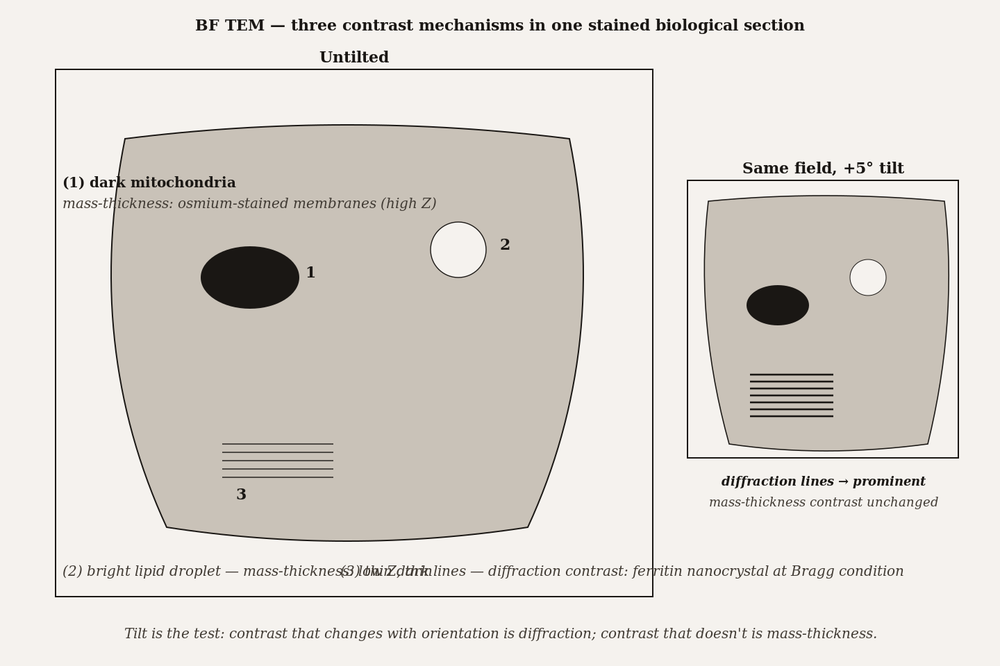
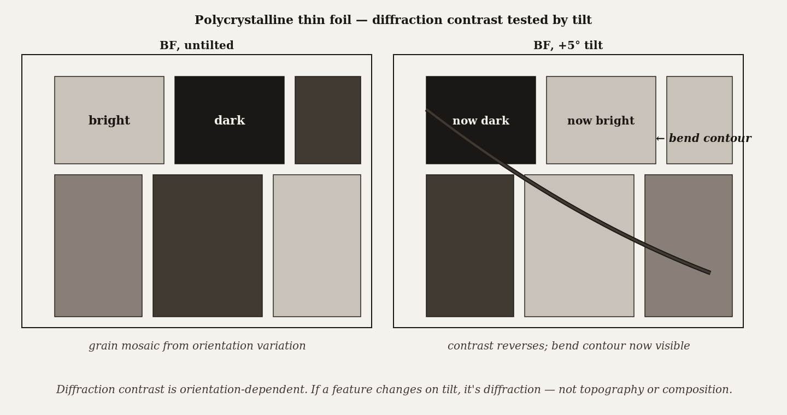

# Chapter 16 — TEM Contrast Mechanisms

*The same specimen, the same electrons, the same instrument — and yet a five-degree tilt conjures dark lines where there were none. Something is reading the crystal's geometry that the eye cannot see directly.*

---

A graduate student is looking at a bright-field TEM image of stained mouse liver cells at 50,000 magnifications. Mitochondria appear dark against the lighter cytoplasm. Lipid droplets appear bright. A few dense ferritin clusters are nearly black. Then the student tilts the specimen five degrees. Most of the image shifts slightly but remains recognizable — the mitochondria are still dark, the lipid droplets still bright. But inside one mitochondrion, thin dark lines appear that were not there before. They were not hidden by anything; they were absent. The tilt changed the orientation of a ferritin nanocrystal embedded in the mitochondrion, bringing one of its crystallographic planes into the Bragg diffraction condition, and the suddenly-diffracting planes scatter electrons out of the beam and into darkness.

Three different things are happening in that one image. The mitochondria are dark because osmium stain bound to their membranes raises the local effective atomic number, scattering more electrons out of the beam. The lipid droplets are bright because lipid scatters weakly — low average atomic number, thin. The ferritin's dark lines appear because a crystal lattice is now oriented to Bragg-diffract a large fraction of the incident electrons out of the direct-beam direction. One image, three contrast mechanisms. And none of them is what an optical microscope uses.

Understanding TEM images means understanding which mechanism produced the gray level you are looking at. Getting this wrong is not a minor interpretive error. A diffraction-induced dark band mistaken for a mass-thickness gradient leads to wrong conclusions about composition; a Fresnel fringe at an edge mistaken for a thin film changes the scientific story. The contrast mechanism is the physics behind every pixel.

*Figure 1.* Three contrast mechanisms in one stained section. Tilt is the test: contrast that changes with orientation is diffraction; contrast that doesn't is mass-thickness.

---

There are three mechanisms, and the first thing to establish is the distinction between two fundamentally different classes.

In **amplitude contrast**, the image is formed because different regions of the specimen send different *numbers* of electrons through the objective aperture. Some regions scatter electrons strongly — out of the direct-beam direction, beyond the aperture — and those regions appear dark. Other regions scatter weakly — most electrons pass through and continue toward the camera — and those regions appear bright. The aperture is the instrument that converts a difference in scattering into a difference in intensity. Without the aperture, amplitude contrast nearly disappears.

In **phase contrast**, the aperture is removed or very large, and electrons scattered in many directions pass through simultaneously. Those electrons — scattered and unscattered, from different paths through the specimen — interfere at the image plane. Where they interfere constructively, the image is bright. Where destructively, dark. The image is not a shadow of the scattering cross-section; it is an interference pattern encoding the relative phases of the waves that passed through different parts of the specimen. The atomic structure of the crystal is legible in the phase relationships of the scattered waves.

That distinction — amplitude or phase, exclusion or interference — governs everything that follows.

---

Within amplitude contrast, two physically distinct processes produce the scattering.

The first is **mass-thickness contrast**. In amorphous and biological specimens, electrons scatter inelastically and quasi-elastically from atomic nuclei in a way that depends on atomic number and specimen thickness. The scattering cross-section scales roughly as the square of the atomic number: a uranium atom ($Z = 92$) scatters electrons roughly $(92/6)^2 \approx 235$ times more strongly than a carbon atom ($Z = 6$). And a thicker region provides more atoms per beam path, so it scatters more strongly than a thinner region of the same composition. Darker pixel means: more mass, higher atomic number, or greater thickness in the beam direction.

For biological specimens — cells, organelles, protein complexes — the intrinsic variation in atomic number is small. Carbon, hydrogen, oxygen, nitrogen are all low-Z, all similar to each other, and the contrast between a mitochondrion and its surrounding cytoplasm is nearly nonexistent without intervention. **Heavy-metal staining** is the intervention. Osmium tetroxide fixes and stains lipid membranes; uranyl acetate binds to nucleic acids and proteins; lead citrate stains a broader range of structures. Each of these compounds brings atoms with $Z$ in the range 72–92 into intimate contact with biological structures, and those atoms scatter so much more strongly than the surrounding carbon and oxygen that the stained structure becomes dark. In the osmium example: one osmium atom among a hundred specimen atoms more than doubles the local scattering cross-section. A small fraction of heavy atoms goes a very long way.

For nanoparticles and polymers, mass-thickness contrast is also dominant and interpretively straightforward. A dense iron oxide nanoparticle sitting on a thin carbon support film scatters strongly (high $Z$, dense) and appears dark; the carbon support scatters weakly and appears almost transparent. A polymer particle on carbon support has no Z contrast; only variations in thickness produce contrast — a sphere looks like a dark disk because its center is thicker than its edge.

The practical levers for mass-thickness contrast are: smaller objective aperture (excludes more of the scattered electrons, raises contrast), lower accelerating voltage (electrons scatter more strongly at lower energy, raising contrast but also increasing beam damage), and heavier staining (more scattering atoms, higher intrinsic contrast). Each of these trades something: a smaller aperture reduces signal and depth of field; lower voltage means more damage to beam-sensitive biological specimens; heavier staining can obscure fine structure.

<!-- → [INFOGRAPHIC: mass-thickness contrast diagram — cross-section of a BF TEM beam path showing two specimen regions side by side: (1) light region (low Z, thin) with most electrons passing through the objective aperture to the camera; (2) dark region (high Z or thick) with most electrons scattered outside the aperture and blocked; label showing $Z^2$ scaling for scattering cross-section; inset showing BF camera output: bright pixel for region 1, dark pixel for region 2; secondary panel showing effect of aperture size — small aperture blocks more scattered electrons, increasing contrast at the cost of signal] -->

---

The second source of amplitude contrast is **diffraction contrast**, and it operates only in crystalline specimens.

Bragg's law — covered in Chapter 15 — states that a set of crystal planes with spacing $d$ diffracts electrons constructively when the beam arrives at angle $\theta_B$ satisfying $2d \sin\theta_B = \lambda$. When this condition is satisfied, a substantial fraction of the incident beam — in strongly diffracting conditions, thirty to eighty percent — is diverted into the diffracted direction, away from the direct beam. If the objective aperture is centered on the direct beam (bright-field mode), those diffracted electrons are blocked, and the diffracting region appears dark.

The key feature of diffraction contrast is its extreme sensitivity to crystal orientation. A grain that satisfies a Bragg condition for one of its lattice planes diffracts strongly and appears dark; the same grain tilted just one or two degrees away from the Bragg condition diffracts weakly and appears bright. Adjacent grains with different orientations appear at different gray levels not because they differ in composition or thickness, but because they differ in orientation relative to the beam. This is why a bright-field image of a polycrystalline metal looks like a mosaic of different grays even though every grain has the same chemical composition: each grain is a different shade of dark depending on how close its planes are to a Bragg condition.

The consequence for defects is powerful. A dislocation is a line defect in a crystal where the lattice is locally distorted — the planes on one side of the line are bent relative to those on the other. That local distortion changes the local Bragg condition: near the dislocation core, the lattice planes are tilted by a fraction of a degree relative to the perfect lattice away from the dislocation. If the crystal is oriented near a Bragg condition, the region near the dislocation core either satisfies or fails to satisfy the condition differently from the surrounding perfect lattice, and the dislocation appears as a thin dark line in bright-field. The dislocation line is not visible because it is dense or thick; it is visible because its strain field changes the local diffraction geometry.

To maximize this visibility, the operator uses a **two-beam condition**: tilt the specimen slightly off its nearest zone axis until exactly one strong Bragg reflection is excited. At a zone axis (where the beam is perfectly aligned with a high-symmetry crystallographic direction), many diffractions are weakly excited simultaneously, and their contributions overlap and partially cancel. Away from the zone axis at a two-beam condition, one reflection is strongly excited and all others are weak; the diffraction-contrast signal from that one reflection is maximized and the image is as sensitive as possible to defects that distort those planes.

A related phenomenon is **bend contours**: dark bands that sweep across a bright-field image when the specimen is slightly bent. A real thin foil is never perfectly flat; different regions have slightly different orientations because of the bending. Where the local orientation satisfies a Bragg condition, that region goes dark. As the operator tilts the stage, the contours move across the field, tracing out the locus of the Bragg condition across the curved specimen. Bend contours are a signature of crystallinity and are a useful diagnostic: an image full of moving dark bands on tilting is telling you the specimen is crystalline and that diffraction contrast is the dominant mechanism.

*Figure 2.* Polycrystalline thin foil — diffraction contrast tested by tilt. Contrast reverses; a bend contour appears.

---

Phase contrast is different in kind, not just in degree.

When the objective aperture is removed entirely, electrons scattered into many different diffracted beams all pass through the column simultaneously and converge at the image plane. There they interfere. Whether a given image point is bright or dark depends on whether the waves arriving from different scattering directions are in phase (constructive interference, bright) or out of phase (destructive interference, dark). And those phase relationships depend on the crystal structure: the positions of atoms in the unit cell, the spacing and orientation of crystal planes, the coherence of the illuminating beam.

For a single crystal aligned along a low-index zone axis, the interference pattern at the image plane has the periodicity of the crystal lattice. Bright spots, spaced by the lattice spacing of the crystal planes, appear where the waves interfere constructively. If the specimen is thin enough and the defocus and lens aberrations are controlled carefully, those bright spots correspond to atomic column positions — or to the channels between atomic columns, depending on the detailed wave mechanics. This is **high-resolution TEM**: the image that looks like an array of bright dots, where each dot is (under the right conditions) one column of atoms seen end-on.

The resolution that phase contrast can achieve is set not by the aperture but by the information limit of the instrument — the highest spatial frequency (finest detail) that the lens can transfer with adequate phase fidelity. In a modern aberration-corrected instrument, this limit reaches 0.05 nanometers, well within the spacing of typical crystal lattice planes and comfortably below the bond lengths between adjacent atoms. Amplitude contrast, limited by aperture size, cannot reach these length scales. Phase contrast, using the full angular range of scattered electrons, can.

The price is interpretive complexity. The appearance of a phase-contrast HRTEM image depends sensitively on specimen thickness, defocus, beam orientation, and objective-lens aberrations. Bright spots can be at atomic columns in one imaging condition and between them in another. Two images of the same specimen at slightly different thicknesses can look quite different even though the atomic structure has not changed. For known crystal structures, the interpretation can often be done by eye with experience. For novel structures or sub-angstrom resolution claims, image simulation — computing the expected image from a proposed structural model and comparing with the experimental image — is required.

![HRTEM phase contrast — the same Si [110] structure at two defocus values. Bright spots at atom columns or between them, depending on Δf and t.](../images/16-tem-contrast-mechanisms-fig-03.png)

*Figure 3.* HRTEM phase contrast — the same Si [110] structure at two defocus values. Bright spots at atom columns or between them, depending on Δf and t.

The simplest phase-contrast effect — accessible without any special equipment or extreme operating conditions — is **Fresnel fringes** at edges. At the boundary between an empty hole in the support film and the film itself, the electron wave passing through the hole has a different phase than the wave passing through the carbon. They interfere at the edge, producing alternating bright and dark stripes parallel to the boundary. These fringes are sensitive to focus in a specific and useful way: underfocused images show a bright fringe on the specimen side of the edge; overfocused images show a bright fringe on the vacuum side; exactly at focus the fringes minimize. This is the operator's most reliable focus diagnostic, usable on any specimen with a clean edge and any modern TEM. The physics is identical to lattice-fringe formation; the scale is just much larger.

---

The three mechanisms span a remarkable range of scales, and a single TEM session can move through all of them by changing a few operating parameters.

Mass-thickness contrast operates over hundreds of nanometers — the integrated scattering through a stained organelle. Diffraction contrast operates over the size of crystal grains — tens to hundreds of nanometers. Phase contrast operates at the scale of individual lattice planes — fractions of a nanometer. The same instrument produces all three by changing accelerating voltage, objective aperture, specimen tilt, and defocus.

<!-- → [INFOGRAPHIC: scale bar diagram — horizontal axis from 0.05 nm to 1,000 nm on log scale; three colored bars spanning their respective operating ranges: (1) phase contrast, 0.05–2 nm, labeled "lattice fringes, atomic columns"; (2) diffraction contrast, 2–500 nm, labeled "grain boundaries, dislocations, bend contours"; (3) mass-thickness contrast, 5–1,000 nm, labeled "organelles, nanoparticles, stained structures"; below each bar, the key operator parameter that activates it (aperture removed / two-beam tilt / small aperture + staining); student should see that the three mechanisms are not competing alternatives but sequential tools at different resolution scales] -->

The practical discipline is to name the mechanism before interpreting the image. The method of getting there is a short checklist. Is the specimen crystalline or amorphous? If amorphous, amplitude contrast from mass-thickness dominates; go looking for staining artifacts, thickness gradients, and Z variations. If crystalline, tilt sensitivity is the next question: does the image change dramatically when the stage tilts by a few degrees? If yes, diffraction contrast is active; go looking for bend contours, grain boundaries at different gray levels, and dislocation lines. Is the aperture removed or very large, and is the specimen aligned on a zone axis? If yes, phase contrast is active; go looking for periodic fringe patterns and be cautious about interpreting bright spots without checking the focus and thickness conditions.

These are not mutually exclusive. A ferritin crystal embedded in a stained biological section simultaneously shows mass-thickness contrast (the iron-rich core is dense and high-Z) and diffraction contrast (the iron oxide is crystalline). A thin foil of semiconductor with an amorphous oxide surface layer has diffraction contrast from the crystal and mass-thickness contrast from the oxide. Real specimens are mixtures; the operator's job is to identify which mechanism dominates at the scale and in the region being examined, and to design the experiment — kV, aperture, tilt, stain, preparation — so that the mechanism that answers the question is the one that is active.

---

Chapter 17 takes phase contrast and asks what it can reveal about atomic structure in HRTEM and STEM — and why the two techniques, despite both achieving atomic resolution, show the specimen through completely different physical lenses. Chapter 18 introduces energy-loss spectroscopy, where the energy spectrum of transmitted electrons carries chemical information that none of the three contrast mechanisms directly provides. And Chapter 23 returns to all of this with a comparative eye toward artifacts: what each mechanism produces that can be mistaken for something else, and how to tell the difference.

The question this chapter raised but did not answer is: how exactly does the relationship between the contrast-transfer function and the defocus settings determine what HRTEM images look like? Chapter 17 develops the transfer function and shows what it implies for which structural details are faithfully imaged and which are phase-inverted or suppressed.

---

## Exercises

### Warm-up

**16.1** — For each of the following, name the dominant contrast mechanism: (a) a BF image of an osmium-stained tissue section showing dark mitochondria; (b) a BF image of a polycrystalline copper foil in which adjacent grains have different gray levels despite identical composition; (c) an HRTEM image of a silicon crystal with a periodic array of bright spots spaced 0.19 nm apart. *(Tests: mechanism identification. Difficulty: easy.)*

**16.2** — Explain in two sentences why the objective aperture is essential for amplitude contrast but works against phase contrast. *(Tests: aperture role in the amplitude/phase distinction. Difficulty: easy.)*

**16.3** — You tilt a BF TEM image of a polycrystalline metal by 3° and observe that some grains became darker while others became brighter. Is this consistent with mass-thickness contrast, diffraction contrast, or phase contrast? What one additional observation would confirm your answer? *(Tests: tilt-sensitivity as a mechanism diagnostic. Difficulty: easy.)*

### Application

**16.4** — A researcher images cobalt-iron oxide nanoparticles (average $Z \approx 27$) on a carbon support film ($Z = 6$). Using the $Z^2$ scaling of elastic scattering cross-section, estimate how much more strongly a cobalt-iron oxide region scatters than the carbon support at the same thickness. Predict whether the particles appear dark or bright in BF, and name one operating-condition change that would increase the contrast. *(Tests: $Z^2$ scaling applied numerically; contrast-lever prediction. Difficulty: medium.)*

**16.5** — A graduate student wants to image dislocations in a nickel thin foil. They orient the specimen to the [001] zone axis and acquire a BF image. No dislocations are visible. Explain why zone-axis orientation is a poor choice for dislocation imaging and describe the tilt procedure that would maximize dislocation visibility. *(Tests: two-beam condition rationale and procedure. Difficulty: medium.)*

**16.6** — You are imaging a TEM specimen at 100,000× and notice bright/dark stripes parallel to the edge of a hole in the support film. When you turn the focus knob slightly, the stripes shift: the bright stripe moves from the specimen side of the edge to the vacuum side. Name the phenomenon, explain its physical origin, and state what information you can extract from the direction of the shift. *(Tests: Fresnel fringe identification and focus diagnostic. Difficulty: medium.)*

**16.7** — A BF image of a bent thin foil shows a dark band sweeping across the field as the stage is tilted. A labmate suggests the dark band is a grain boundary. Give two observations that would distinguish a bend contour from a grain boundary. *(Tests: bend contour vs. structural feature diagnostic. Difficulty: medium.)*

### Synthesis

**16.8** — A semiconductor researcher has a thin cross-section of a multilayer device: a single-crystal silicon substrate, a 5-nm amorphous silicon dioxide gate oxide, and a polycrystalline tungsten metal contact. For each layer, identify the dominant contrast mechanism, predict whether the layer appears dark or bright relative to its neighbor in BF, and name one operating-condition change (kV, aperture, tilt) that would enhance the contrast of that specific layer. *(Tests: mechanism assignment across amorphous/crystalline/compositional variation; operating condition selection. Difficulty: hard.)*

**16.9** — An HRTEM image of a novel oxide crystal shows a periodic array of bright spots that the researcher interprets as atomic column positions. A reviewer asks for image simulation. Write a two-paragraph response explaining why the reviewer's request is scientifically justified — specifically addressing: how phase-contrast image appearance depends on defocus and specimen thickness, and under what conditions the bright spots might not correspond to atomic column positions. *(Tests: HRTEM interpretability limits and simulation rationale. Difficulty: hard.)*

### Challenge

**16.10** — Find a published TEM figure in your research field where the contrast mechanism is named in the methods or caption. Verify the claim by checking: (a) whether the aperture conditions are consistent with the stated mechanism; (b) whether the operating voltage and tilt conditions are appropriate; and (c) whether any artifact of that mechanism is visible in the image that the authors may not have addressed. *(Difficulty: open-ended.)*

---

 evidence that any single TEM contrast mechanism can substitute for the others in routine materials characterization. The empirical practice of combining BF survey imaging, dark-field or two-beam diffraction imaging for defect analysis, and HRTEM phase contrast for atomic structure suggests that the three mechanisms are genuinely complementary, not redundant. A technique that collapsed all three into one measurement would be transformative; nothing currently available comes close.

**Still puzzling:** the practical boundary between HRTEM images that can be interpreted by inspection — by an experienced microscopist who recognizes familiar crystal structures — and those that require full image simulation remains largely tacit. The field has not produced a clean criterion for when simulation is necessary, and the result is that some published HRTEM interpretations rest on more evidence than they acknowledge and others rest on less. This is an epistemological gap that deserves more attention than it gets.

