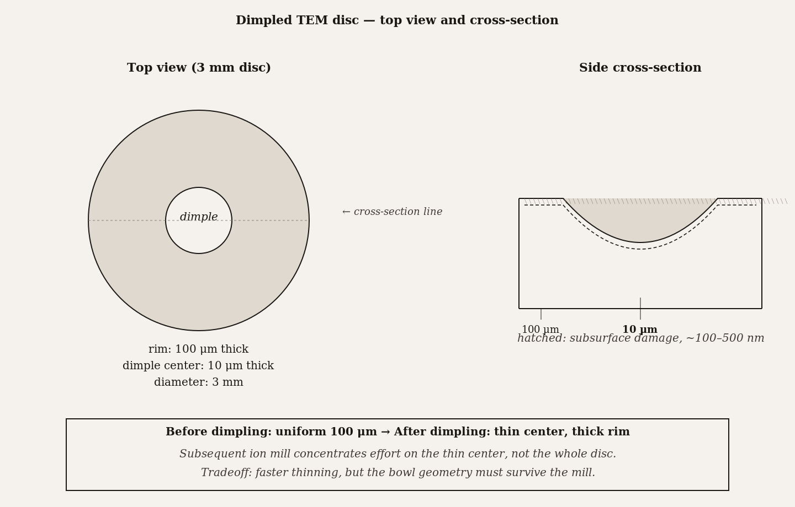
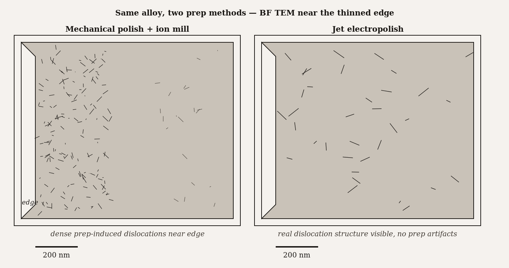
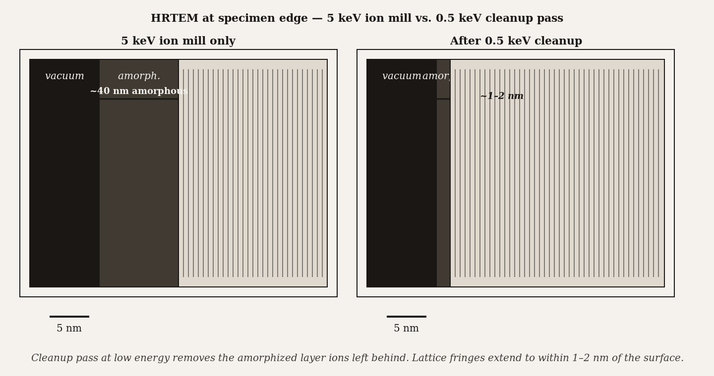

# Chapter 22 — TEM Sample Preparation for Inorganic and Materials Science Specimens

*A chunk of steel starts at five millimeters thick. The electron beam needs it under one hundred nanometers. Five orders of magnitude separate the starting point from the requirement, and every order of magnitude has its own technique.*

---

A graduate student carries a small piece of stainless steel to the TEM prep lab — roughly 5 mm × 5 mm, about a millimeter thick, unremarkable. The goal is to image dislocations in the steel by TEM. The bulk specimen is opaque to electrons; somehow, the student needs to thin part of it to below 100 nanometers while preserving the dislocation structure that the imaging is intended to reveal.

Three days later, the student loads a three-millimeter disc of steel into a TEM holder. Most of the disc is still a hundred micrometers thick — mechanically robust enough to handle. But at the center, where a grinding process removed material in a shallow bowl shape and then an argon-ion beam finished the job, there is a perforation surrounded by a region thinner than 100 nanometers. The student finds this region, fires up the beam at 200 keV, and sees individual dislocations as fine dark lines threading through the steel grains.

The path from the original slab to that disc took: cutting to the three-millimeter disc format, mechanical grinding down to about a hundred micrometers, dimple grinding to create a concave depression at the center that reaches down to about ten micrometers, and finally ion milling — argon ions at a glancing angle sputtering the specimen thinner over several hours until the dimple perforate. Four steps, three days, five orders of magnitude reduction in thickness. Every step was load-bearing; skipping any one of them would have left the specimen either too thick to image or too damaged to trust.

Inorganic TEM preparation is not the same problem as biological TEM preparation. There is no fixation, no dehydration, no embedding resin, no ultramicrotome. Instead there is mechanical thinning, electrochemical dissolution, ion bombardment, and — for the highest precision — focused gallium ions milling a lamella from exactly the feature the operator has identified. Each technique has its own physics, its own artifacts, its own material restrictions. The chapter's governing question is which technique serves which specimen and which question.

<!-- → [INFOGRAPHIC: five-orders-of-magnitude reduction diagram — vertical log scale from 5 mm to 50 nm; four labeled steps with thickness ranges: (1) Bulk specimen → Cut disc: 5 mm → 200 μm (diamond saw/ultrasonic cutter); (2) Grinding and polishing: 200 μm → 100 μm (grit sequence); (3) Dimple grinding: 100 μm → 10 μm (center only); (4) Ion milling or FIB: 10 μm → <100 nm (final thinning); each step labeled with its characteristic artifact; student should see the full pipeline as a single figure before reading the detailed sections] -->

---

The universal requirement across all routes is geometric. The TEM holder accepts a three-millimeter disc. The TEM beam needs the imaging region below 100 nanometers — more precisely, below the inelastic mean free path at the operating voltage, typically 50 to 100 nanometers for 200 keV electrons in most metals and ceramics. That region should be as flat and as representative of the bulk material as the preparation can achieve. Every technique in this chapter is, in essence, a different answer to the question: how do you get from bulk specimen to three-millimeter disc to sub-100-nanometer transparent region, with the least damage to the features you want to see?

Inorganic specimens add constraints that biological specimens do not have. Magnetic specimens deflect the electron beam inside the column and distort images. Insulating specimens charge under the beam and produce field distortions that mimic structural features. Very hard materials resist mechanical polishing; very soft materials deform under it. Multi-phase materials thin non-uniformly because each phase has a different mechanical hardness or electrochemical dissolution rate or ion sputter yield. The prep technique must be matched not just to the thinning goal but to the material's specific response to each thinning mechanism.

---

Mechanical preparation is the foundation on which everything else rests. The bulk specimen is too thick for any final-thinning technique to handle efficiently; mechanical steps bring it down to a manageable starting point.

The first step is cutting the specimen to disc. For hard ceramics and semiconductors, a diamond wire saw or ultrasonic disc cutter sections the material without cracking it. For metals, a diamond-edged saw or a shear-press disc punch works. The disc is the geometry the holder requires; get to it first, then thin.

Grinding follows: a sequence of successively finer abrasive papers, typically silicon carbide, run wet to prevent heat buildup. The standard sequence moves through increasingly fine grits, each removing the scratches from the previous step, until the disc is down to around 100 micrometers and the surface is scratch-free at the scale that matters. Then diamond suspension polishing — 30 micrometers, 9, 3, 1, down to 0.05-micrometer colloidal silica — brings the surface roughness below 50 nanometers.

This is still not thin enough for TEM, but it is thin enough for the next step to be efficient: **dimple grinding**. A rotating diamond wheel, set to the center of the disc, removes material from the center of one face in a shallow bowl shape. The rim of the disc stays at 100 micrometers — mechanical support. The center of the dimple reaches down to about 10 micrometers. That 10-micrometer center is what the ion mill or the FIB will finish.

Mechanical preparation has a characteristic artifact: sub-surface damage. Grinding and polishing work by fracture and plastic deformation at the surface; in a crystalline metal, this means dislocations, work-hardening, and a damaged layer that extends below the visibly polished surface — sometimes tens or hundreds of nanometers below the surface in soft metals. For dislocation imaging in a steel, prep-induced dislocations mixed with the real ones are a problem. For composition mapping by EDS, they are often irrelevant. The operator decides whether to remove the damaged layer (by subsequent ion milling) or tolerate it.

*Figure 1.* Dimpled TEM disc — top view and cross-section. Dimpling concentrates subsequent ion-mill effort at the thin center.

---

For conducting metals, there is a cleaner alternative to mechanical polishing for the final thinning: **jet electropolishing**. The specimen is the anode in an electrochemical cell. An electrolyte — a concentrated acid chosen specifically for the material — is jetted onto the center of the disc. Metal at the anode dissolves into the electrolyte. The jetting concentrates the dissolution at the disc's center; as the center thins, a perforation forms there, surrounded by an electron-transparent annular region. When light transmits through the specimen, the operator stops. The result is a smooth, damage-free thinned region with no work-hardening, no sub-surface dislocations, no mechanical artifacts.

The electrolyte is the constraint. Different metals require different electrochemical conditions. Steel and nickel use perchloric acid in acetic acid or methanol; aluminum uses perchloric in ethanol; copper uses phosphoric acid in ethanol. The wrong electrolyte either fails to thin the material or produces pitting rather than uniform dissolution.

Perchloric acid in alcohol mixtures deserves its own paragraph. Perchloric acid is a strong oxidizer; alcohols are fuel. The combination is stable under the controlled conditions of a properly designed electropolisher running established recipes at controlled temperature. It is explosive under improper conditions: heating, contamination, improvised recipes, old reagents. Every electropolishing lab has procedures for this chemistry because the consequences of ignoring them are severe. The protocol is: use published recipes, use fresh reagents, work in a fume hood with a face shield and acid-resistant gloves, never improvise. This is not routine caution — it is the specific caution that this chemistry requires.

Electropolishing also produces hydrogen at the cathode. Hydrogen is flammable, and in a confined space the concentration can reach explosive levels. The work area needs ventilation, and the operator should not seal the cell during operation.

The payoff for following the protocol correctly is a specimen surface that has seen no mechanical work — pristine crystallographic structure right to the thinned region, suitable for high-resolution imaging and diffraction work where a few nanometers of prep-induced disorder would be interpretively significant.

*Figure 2.* Same alloy, two prep methods. Mechanical polish + ion mill leaves dense prep-induced dislocations near the edge; jet electropolish does not.

---

For most specimens, whether mechanically polished or electropolished to a dimple, the final step toward electron transparency is **broad-beam ion milling**. Argon ions, accelerated to a few kilovolts, are directed at the specimen at a grazing angle — typically about five degrees from the specimen surface. At that angle, the collision cascades from each ion impact are concentrated near the surface rather than deep in the material, maximizing the fraction of atoms ejected and minimizing the depth of ion implantation. The ion beam rotates around the disc, thinning symmetrically, until the dimple perforates and the surrounding region is transparent.

Ion milling requires four to twelve hours for a typical inorganic specimen. The operator sets the energy and angle, turns on the mill, and waits. Modern instruments have optical detectors that signal when the perforation occurs; older ones require periodic checks. The final perforation is the endpoint; the thin annulus around it is the imaging region.

The damage artifact from ion milling is amorphization: the top few nanometers of every milled surface have been disrupted by the ion cascade into an amorphous layer that no longer has the crystalline structure of the bulk. At 5–10 keV, this layer is 5–10 nanometers thick. For most imaging purposes this is invisible — the damage layer is thinner than the specimen's total thickness and does not contribute much to the image. For HRTEM lattice imaging, where the outermost atomic planes are the subject, the amorphous surface layer obscures the lattice fringes right at the specimen faces and is genuinely problematic.

The solution is a **low-energy cleanup pass**: after the main mill reaches the target thickness, the ion energy is dropped to 0.5–1 keV and the mill runs for a shorter time at a shallower angle. At this energy, the ions do not penetrate deeply enough to implant; they remove the amorphized layer from the previous mill without adding a new one. This cleanup pass is now standard practice before high-resolution TEM of ion-milled specimens. The cost is an extra hour or two; the benefit is lattice fringes that extend to the specimen surface rather than disappearing into the amorphous zone.

*Figure 3.* HRTEM at the specimen edge — 5 keV ion mill leaves an ~8 nm amorphized layer. A 0.5 keV cleanup pass removes it; lattice fringes extend to within 1–2 nm of the surface.

---

All the techniques described so far produce specimens in which the imaging area is determined by where the disc center happens to be. The thinning is non-localized: the whole disc gets thinner together. For most questions this is fine. For a question that begins "I want to image this specific transistor in this specific packaged chip" or "I want to look at the grain boundary at this particular location in this deformed sample," non-localized thinning fails — the chance that the non-localized prep happens to produce electron-transparent material at exactly the right location is essentially zero.

**FIB lift-out** — introduced in Chapter 10 in the context of failure analysis — is the answer to site specificity. In a dual-beam FIB-SEM, the SEM column identifies the target feature; the FIB column mills a lamella from exactly that location. The steps:

A protective platinum strip is deposited over the target by FIB-induced gas decomposition, shielding the target surface from the oblique ion milling that follows. Two rectangular trenches are milled on either side of the platinum strip, leaving a thin wall of specimen between them — the lamella. The FIB mills underneath to release the lamella from the substrate, and a tungsten micromanipulator lifts the lamella out of the trench and carries it to a TEM grid, where it is welded in place by platinum deposition. The lamella is then thinned by further FIB milling, from both sides, down to the target thickness — typically 50 to 100 nanometers. A final cleanup pass at 2–5 keV removes the damaged surface.

The entire procedure takes two to six hours. The lamella can come from any location on any surface, identified in advance by SEM or by electrical testing or by any other diagnostic. Site precision is routinely below 100 nanometers — well sufficient to hit a specific transistor in a device or a specific inclusion in a weld.

The damage artifacts from FIB lift-out are the same as from any gallium-ion milling: amorphization at the surfaces (5–20 nanometers at 30 keV, reduceable by the cleanup pass), implanted gallium (which shows as a spurious peak in EDS and alters local electrical properties), curtaining (vertical striations across the cross-section face where layers of alternating hardness created uneven milling rates), and redeposition (sputtered material landing back on adjacent surfaces). These are managed rather than eliminated: the protective platinum deposit reduces surface damage at the entry face; the cleanup pass reduces amorphization; the scan pattern and gas-assisted etching reduce curtaining and redeposition. A well-executed FIB lift-out lamella, after cleanup, is clean enough for lattice imaging at 0.2-nanometer resolution.

---

The choice between routes reduces to three questions: does the specimen conduct? is there a compatible electropolishing electrolyte? and does the imaging location need to be specified in advance?

If the material is a metal with a known electrolyte, and if any part of the thinned disc will serve the question, jet electropolishing is the cleanest route. It produces no mechanical damage and leaves the crystalline structure undisturbed to the surface.

If the material is a ceramic, semiconductor, or other non-conductor — or a metal whose electrolyte chemistry is unknown or hazardous — mechanical plus ion milling is the standard route. It works on essentially any solid material.

If the question requires imaging a specific location — a specific device feature, a specific defect, a specific inclusion identified by another technique — FIB lift-out is the only route that can deliver the necessary spatial precision.

In practice, most materials-science TEM prep combines routes. The bulk specimen is mechanically thinned; the dimple grind reduces the center; the ion mill does the final work. For high-resolution work, the low-energy cleanup pass removes the amorphization. For site-specific work, the FIB replaces the entire final-thinning pipeline. The skill the operator develops is reading the specimen type and the research question and matching them to the combination of techniques that produces the least damage at the imaging area.

<!-- → [INFOGRAPHIC: prep-route decision tree — root: "What is your specimen?"; branch 1: conducting metal with known electrolyte + no location specificity → jet electropolishing; branch 2: ceramic / insulator / unknown electrolyte → mechanical + dimple + ion mill + (optional) cleanup pass; branch 3: any material + specific imaging location required → FIB lift-out + cleanup pass; branch 4: nanoparticles or powder → dispersion on grid; each terminal node labeled with characteristic artifact and typical time cost; student should use this as a quick reference for technique selection] -->

---

What carries across all of this is the five-orders-of-magnitude problem stated at the beginning. The molecular-scale order of the original material — the dislocations, the grain boundaries, the interface structures — must survive the entire reduction from millimeter bulk to nanometer thin section. Each step in the pipeline threatens that order in a different way: grinding smears it, electropolishing dissolves it selectively if conditions are wrong, ion milling amorphizes it at the surface, gallium ions implant foreign atoms and damage the lattice. The operator's job is not to eliminate these damage mechanisms — none of them are eliminable — but to understand each one well enough to choose damage that is tolerable for the imaging question and to apply cleanup steps that remove what is intolerable.

Chapter 23 returns to all of these artifacts in a comparative context, alongside the imaging artifacts introduced by the TEM itself. Understanding prep-induced artifacts and instrument-induced artifacts as two separate classes, each with its own mechanisms and signatures, is the diagnostic foundation for reading a published TEM image critically.

---

## Exercises

### Warm-up

**22.1** — Name the four major prep routes for inorganic TEM specimens and give one sentence each describing the physical mechanism by which each one thins the specimen. *(Tests: prep route identification and mechanism recall. Difficulty: easy.)*

**22.2** — Why is dimple grinding performed before ion milling rather than skipping directly from mechanical polishing to ion milling? Give a quantitative reason involving time. *(Tests: dimple grinding rationale and thickness arithmetic. Difficulty: easy.)*

**22.3** — An HRTEM image shows lattice fringes across the bulk of the specimen but the fringes abruptly stop about 8 nm from the surface on both faces. Name the artifact, identify its cause, and describe the prep step that would have prevented it. *(Tests: ion-milling amorphization recognition and cleanup pass rationale. Difficulty: easy.)*

### Application

**22.4** — A researcher wants to image dislocations in a single-crystal nickel superalloy by TEM at the two-beam diffraction condition. They have access to a jet electropolisher (electrolyte: perchloric acid + acetic acid for Ni alloys) and a broad-beam ion mill. (a) Which final-thinning route is preferable for dislocation imaging, and why? (b) What specific artifact of the alternative route would contaminate the dislocation count? *(Tests: electropolish vs. ion mill decision based on artifact type for a specific imaging question. Difficulty: medium.)*

**22.5** — A graduate student is setting up a perchloric acid + ethanol electropolishing solution for aluminum TEM preparation. List three specific safety hazards this chemistry presents and the corresponding precautionary measures. *(Tests: electropolishing hazard identification and mitigation. Difficulty: medium.)*

**22.6** — A TEM lamella prepared by FIB lift-out shows vertical striations (curtaining) across the cross-section face, running through layers of alternating composition. Identify the cause of curtaining in terms of the FIB milling physics and propose two distinct mitigation strategies, one before milling and one during milling. *(Tests: FIB curtaining origin and mitigation, integrating Chapter 10 sputtering physics. Difficulty: medium.)*

**22.7** — You are preparing a TEM cross-section of a multilayer thin film: 50 nm gold / 20 nm titanium nitride / silicon substrate. The interfaces between layers are the features of interest. Compare mechanical + ion mill versus FIB lift-out for this specimen, addressing: (a) whether site specificity is needed, (b) differential thinning risk, and (c) the artifact each route introduces at the layer interfaces. *(Tests: route comparison on a real layered specimen with multiple artifact considerations. Difficulty: medium.)*

### Synthesis

**22.8** — A failure analyst needs to characterize a cracked grain boundary in a turbine blade alloy (nickel base) at HRTEM resolution. The crack is at a known location identified by SEM fractography. Plan a complete prep workflow from bulk specimen to HRTEM-ready lamella, specifying: (a) the prep route and rationale, (b) the steps in order with estimated time for each, (c) the artifacts introduced at each step and how each will be managed, and (d) what the HRTEM image would show if the cleanup pass is skipped versus if it is performed. *(Tests: end-to-end workflow design integrating all four routes, artifact management, and HRTEM consequence of cleanup. Difficulty: hard.)*

**22.9** — Compare the prep-induced damage hierarchy of the four routes in terms of: (a) depth of subsurface damage, (b) type of structural alteration (work-hardening vs. amorphization vs. chemical contamination), and (c) which imaging modalities are most sensitive to each damage type. Use this comparison to construct a general rule for when each route is appropriate versus inappropriate for HRTEM work. *(Tests: comparative analysis of all four prep routes across damage mechanism, depth, and imaging consequence. Difficulty: hard.)*

### Challenge

**22.10** — Find a published HRTEM paper where the specimen preparation method is described in the methods section. Identify the thinning technique(s) used. For each technique, find or infer: (a) what artifacts were introduced, (b) whether a cleanup pass was used, and (c) whether any artifacts are visible in the images. Comment on whether the preparation choices were appropriate for the imaging claims made. *(Difficulty: open-ended.)*

---

 evidence that a single preparation route can match all the others across different material types for damage quality and spatial precision. The current empirical record is consistent: material-specific routes (electropolishing for metals, ion milling for ceramics, FIB for site-specific) each outperform general-purpose alternatives when matched correctly to the specimen. A universal prep technique would be transformative; none currently exists.

**Still puzzling:** the decision of when to invest in FIB lift-out versus conventional mechanical plus ion-mill prep is driven almost entirely by instrument access and cost, not by a clean pedagogical criterion. Both can produce HRTEM-quality specimens in the right materials; the threshold for switching is economic rather than scientific. Students trained in well-equipped labs default to FIB; those in labs without access default to conventional. Neither group is necessarily making the better choice for the science.

