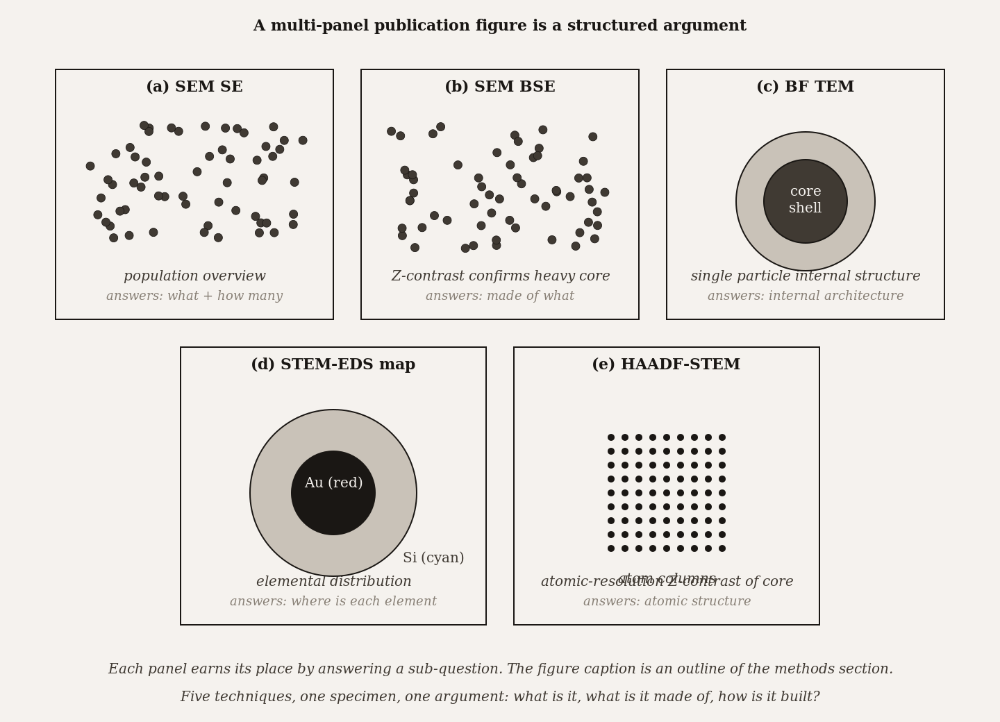

# Chapter 25 — Applications of Electron Microscopy in Nanomedicine, Materials Science, and Engineering

*No single technique tells the whole story. The story comes from the techniques in conversation.*

---

A pharmaceutical company has developed a new lipid nanoparticle formulation for mRNA vaccine delivery. The new formulation differs from the standard by one component — a single ionizable lipid designed to improve cellular uptake. Before clinical trials can begin, the regulatory filing requires structural characterization demonstrating that the particles are the right size, have intact bilayer organization, carry the mRNA in the expected location, and are free of unexpected impurities or aggregates from the manufacturing process.

The team cannot answer all of those questions with one technique. Cryo-TEM shows individual particles at near-native state and resolves the bilayer. Cryo-tomography on single particles reveals where the mRNA sits inside. STEM-EDS confirms elemental homogeneity and the absence of trace contaminants. SEM at moderate magnification surveys enough particles for the size distribution to be statistically meaningful. Six weeks of work, four instruments, twelve figures in the regulatory submission. The formulation passes. Trials begin.

What the team assembled is not a collection of technique demonstrations. It is a structured argument in which each technique answers a specific question that the others cannot: cryo-TEM for bilayer structure, tomography for three-dimensional cargo location, EDS for composition, SEM for population statistics. Removing any one of them leaves a gap in the argument. Adding them together closes it.

This is what cross-technique electron microscopy looks like in practice.

<!-- → [INFOGRAPHIC: lipid nanoparticle multi-technique workflow diagram — four panels connected by arrows showing the information each technique contributes: (1) SEM at moderate magnification → "population statistics: size, shape, aggregation" (hundreds of particles visible); (2) Cryo-TEM → "individual particle bilayer structure: intact bilayer, internal organization" (single particle cross-section); (3) Cryo-tomography → "3D cargo location: mRNA inside or at surface?" (3D rendered reconstruction); (4) STEM-EDS → "elemental homogeneity: trace contamination absent" (elemental map overlay); arrows between panels labeled "what TEM cannot show" / "what tomography adds to single image" / "what EDS adds to structural image"; student should see the information decomposition before reading the physics explanation] -->

---

The logic of multi-technique workflows follows from the physics of each technique — specifically from what each technique can and cannot access.

SEM, run at moderate magnification over a wide field, sees many particles in a single acquisition. A session that images 1,000 nanoparticles provides population statistics: size distribution, shape variation, aggregate fraction. What it cannot resolve is internal structure. The electron beam interacts with the surface and near-surface; it does not pass through. A nanoparticle 100 nanometers across is effectively a surface to the SEM beam.

TEM, with its transmitted beam, sees through the particle. At 200 keV, the beam passes through a 100-nanometer lipid particle and the image is a projection of everything it encountered. The bilayer appears as two dark lines separated by a bright gap because the phospholipid headgroups stain darkly (high electron density) while the hydrophobic core stains lightly. This is the internal structure SEM cannot show. The trade is that TEM images one particle at a time at high magnification; getting population statistics from TEM alone would require hundreds of individual frames.

Cryo-tomography, which acquires a tilt series of projections and reconstructs a three-dimensional volume from them, adds the dimension that the single TEM image projects away. Where does the mRNA sit — in the lipid core, at the surface, distributed throughout the aqueous interior? A single TEM image cannot answer this because it collapses the three-dimensional distribution into a two-dimensional shadow. The tomographic reconstruction answers it, at the cost of dose and acquisition time.

STEM-EDS adds the elemental dimension. The beam in STEM mode is focused to a sub-nanometer probe that scans across the particle; at each position, characteristic X-rays identify which elements are present and at what concentration. If the manufacturing process leaves trace heavy-metal contamination, EDS finds it. If the new lipid component distributes unevenly across the particle, the EDS map shows it. Neither the TEM image nor the SEM survey provides this information.

The pattern is the same across all the nanomedicine applications. Lipid nanoparticles, polymeric drug carriers, magnetic iron oxide contrast agents for MRI, gold nanoparticles for diagnostic assays — each has a set of characterization questions, and each question maps to a technique whose physics makes it the right tool. Size and shape at the population level: SEM. Internal structure: TEM. Three-dimensional structure: tomography. Elemental composition and distribution: EDS or EELS. Crystal phase of an inorganic core: selected-area electron diffraction. Atomic-scale interface structure: HRTEM or HAADF-STEM.

| Characterization goal | Technique | What physics makes it the right tool | Key limitation |
|---|---|---|---|
| **Particle size and shape population (n ≥ 100)** | SEM (uncoated for polymers, coated for inorganics) | High-throughput 2D imaging at moderate resolution; statistics on hundreds of particles | 2D projection; can miss internal structure |
| **Internal structure of a single particle** | TEM bright-field | Transmits through the particle; reveals core-shell, hollow, encapsulated payloads | Sample-prep-intensive; limited statistics |
| **3D cargo location inside a delivery vehicle** | Cryo-electron tomography | Native hydrated state; 3D reconstruction from tilt series | Low signal-to-noise; demands low-dose imaging discipline |
| **Elemental composition (single particle)** | STEM-EDS or STEM-EELS | Characteristic X-ray / energy-loss spectra at nanometer probe size | Beam damage, especially for soft cargo; spectral overlap |
| **Crystal phase identification** | TEM electron diffraction (SAED) or HRTEM with FFT | Reciprocal-space pattern fingerprints crystal structure | Requires single-crystal or near-single-crystal regions |
| **Atomic-resolution interface (e.g., shell on core)** | Aberration-corrected HAADF-STEM | Z-contrast at single-atom sensitivity; composition step at the interface | Restricted to specific instruments; very high beam dose |

---

Materials science runs the same workflow logic with a different set of specimens and questions.

A failure-analysis team receives a fractured turbine blade — the case that opened Chapter 4. The blade failed in service. The team needs to understand why. SEM at low magnification surveys the fracture surface and locates the initiation site: a region where the fracture morphology changed character, the fatigue striations converged, the surface showed unusual topography. That is the answer to "where." EDS at the suspicious region answers "what is there" — identifying whether an inclusion, a segregation, or a corrosion product started the crack. If the EDS points to a specific inclusion, FIB lift-out extracts a lamella from exactly that location: the specific inclusion at the crack initiation site, in cross-section, 80 nanometers thick and ready for TEM. The TEM then answers "what is its structure" — SAED identifies the crystallographic phase of the inclusion, HRTEM shows the lattice mismatch at the inclusion-matrix interface, BF diffraction contrast maps the dislocation density in the matrix adjacent to the inclusion. The conclusion: a titanium nitride inclusion with a specific orientation relationship to the nickel-base matrix, surrounded by a dislocation-dense zone that concentrated strain and initiated the fatigue crack.

No single step in that sequence answers the question alone. The SEM found the location; the EDS found the composition; the FIB retrieved the lamella from the right place; the TEM resolved the structure. Each was load-bearing.

<!-- → [INFOGRAPHIC: turbine blade failure analysis workflow — sequential four-panel flowchart: (1) SEM at low magnification showing fracture surface with fatigue striations; arrow pointing to "initiation zone" circled; label: "SEM: finds the where"; (2) EDS spectrum at the suspect inclusion; label: "EDS: finds the what"; (3) FIB lift-out schematic showing lamella extracted from the circled inclusion; label: "FIB: retrieves the site"; (4) BF TEM + SAED panel showing inclusion phase and dislocation density in matrix; label: "TEM: resolves the structure"; bottom: "conclusion: TiN inclusion + dislocation zone = fatigue initiation"; student should see the load-bearing role of each technique and why removing any step leaves a gap] -->

The same workflow logic applies to catalyst characterization, where the question is how individual metal atoms or sub-nanometer clusters are distributed on a support surface. HAADF-STEM at atomic resolution images the heavy metal atoms as bright spots against the lighter support — the Z-contrast of HAADF (where image brightness scales roughly as $Z^2$) makes a single platinum atom on a carbon support visible. STEM-EELS at each atomic site identifies the oxidation state — whether the platinum is metallic, oxide, or in a specific coordination with the support. HRTEM on the support material resolves the zeolite framework or oxide lattice structure that determines how the catalyst is anchored. Tomography reconstructs the three-dimensional distribution of catalyst particles across the support's pore network — are the particles accessible to reactants, or buried in closed pores? The combination answers the structure-activity relationship question that no single technique could address.

Battery materials present yet another variant of the same logic. The cathode-electrolyte interface in a lithium-ion battery changes chemistry during cycling; understanding that change requires imaging the same interface before and after cycling, at multiple scales. FIB lamellae through the interface provide the cross-section for TEM. STEM-EELS across the lamella maps the lithium distribution and the transition-metal oxidation states on either side of the interface. HRTEM at the interface resolves the atomic structure of the interphase layer that forms during cycling. EDS identifies any elemental redistribution — manganese dissolution, for instance, which is a known failure mode for some cathode chemistries. The full characterization package supports both fundamental understanding and engineering decisions about cell design.

---

Engineering applications compress this logic into a more time-constrained context. Failure analysis in an industrial lab runs SEM + EDS as a first pass: survey the fracture surface, identify compositional anomalies, locate the initiation zone. For most failure cases, that is sufficient. When it is not — when the failure mode requires knowing the defect structure at the atomic scale, or when the failure occurred inside a multilayer device rather than at the surface — FIB cross-section and TEM become necessary. The decision of how far down the technique chain to go is driven by what the question requires and how much time the analysis can consume.

Quality control is simpler: periodic SEM characterization of production samples, statistical measurement of grain size or surface roughness, EDS verification that composition is on-spec. The techniques here are the same as in research, but the question is narrower ("is this batch within tolerance?") and the answer needs to come in hours rather than months.

Forensic analysis occupies the same position: low-kV SEM with EDS for trace evidence characterization, designed to be non-destructive (no coating, minimal dose) so the sample is preserved for legal chain-of-custody and additional analysis. The physics is the same; the constraints are different.

---

The graduate student who designs a multi-technique workflow is doing something that takes practice: reading a research question and decomposing it into sub-questions, each of which maps to a technique. The decomposition is not arbitrary. It follows from knowing what each technique can access — what physical quantity it measures, at what spatial scale, with what artifacts — and from knowing which sub-questions are independent (can be answered separately) versus which are coupled (answering one constrains or enables answering another).

The practical discipline is to start with the broadest scale and work inward. SEM first, to survey the population and identify regions of interest. TEM second, to resolve the internal structure at the scale of interest. Specialized modes third — EELS, tomography, HAADF-STEM — when the question requires chemical state, three-dimensional distribution, or atomic-scale structure that conventional TEM cannot provide. Cross-checks throughout: SE/BSE comparisons, tilt tests, EDS confirmation of compositional claims.

The workflow serves a scientific argument. Every technique produces data; the data must cohere into a conclusion. A figure in a published paper that shows SE, BSE, BF TEM, EDS map, and HAADF-STEM side by side is not a demonstration of technique fluency — it is a structured argument in which each panel answers one sub-question, and together the panels close the case.

*Figure 1.* A multi-panel publication figure as a structured argument. Each panel earns its place by answering a sub-question.

This is why methods sections in modern electron-microscopy papers are as long as they are. The reader needs to know which detector was active for each image, what the accelerating voltage and working distance were, how the specimen was prepared, and what cross-checks were performed. Without that information, the panels cannot be read critically. With it, the reader can assess whether each technique was used at conditions appropriate to the question it was answering, and whether the artifact families relevant to those conditions were addressed.

<!-- → [INFOGRAPHIC: broad-to-specific workflow discipline — inverted pyramid diagram: widest level at top labeled "Survey: SEM, population statistics, many particles/regions"; middle level: "Target: TEM/FIB, internal structure, single particles or sites"; narrow level: "Specialized: EELS/tomography/HAADF, chemical state/3D/atomic structure"; alongside each level: annotation showing typical magnification range, number of features imaged, and which technique cross-checks apply; student should internalize the sequence logic before designing their first workflow] -->

---

The arc of this book has been from the physics of how electrons interact with matter, through the instrument that shapes and detects that interaction, to the techniques that extract different kinds of information from the interaction, to the workflows that combine those techniques into scientific arguments. The graduate student who understands all of that is not just technically proficient — they can sit down with a research question they have never seen before, decompose it into sub-questions, identify the techniques whose physics makes them appropriate for each sub-question, design the workflow that combines them, and read the resulting figures critically.

That is the practitioner the book has been preparing.

Chapter 26 closes the book by addressing how to communicate the multi-technique workflow to a reader: what the methods section must contain, how figures should be captioned, and how to critique published figures using the frameworks developed in Chapters 23 and 25.

---

## Exercises

### Warm-up

**25.1** — For each characterization goal below, name the most appropriate primary technique and state in one sentence why the physics of that technique makes it the right choice: (a) size distribution of 100 nm polymer nanoparticles across a population of 500; (b) internal bilayer structure of a single lipid nanoparticle; (c) three-dimensional distribution of mRNA cargo within a 100 nm particle; (d) oxidation state of iron at a battery cathode-electrolyte interface. *(Tests: question-to-technique mapping by physics. Difficulty: easy.)*

**25.2** — A graduate student claims that SEM alone is sufficient to characterize a lipid nanoparticle drug delivery system for a regulatory submission. Identify two specific characterization requirements that SEM cannot address and name the technique that addresses each. *(Tests: SEM access limitations and workflow necessity. Difficulty: easy.)*

**25.3** — In the turbine blade failure analysis, the SEM survey and EDS composition data are followed by FIB lift-out and TEM. Explain in two sentences why FIB lift-out is necessary at this stage rather than conventional mechanical TEM preparation. *(Tests: site-specificity logic for FIB in a workflow context. Difficulty: easy.)*

### Application

**25.4** — Design a multi-technique characterization workflow for magnetic iron oxide nanoparticles intended as MRI contrast agents. The characterization must answer: (a) size and shape of the iron oxide cores, (b) crystal phase (Fe₃O₄ vs Fe₂O₃ vs other phases), (c) distribution of polymer coating thickness, and (d) confirmation that no free heavy-metal contamination is present. For each goal, name the technique, the key information it provides, and one artifact specific to that technique and specimen that the operator must address. *(Tests: workflow design for a real nanoparticle system across four distinct characterization sub-questions. Difficulty: medium.)*

**25.5** — A battery research group has cycled a lithium-ion cell 500 times and wants to characterize how the cathode-electrolyte interface changed. Their methods section reports: "SEM-EDS at 15 kV on bulk cathode material." Identify three characterization sub-questions that this workflow cannot answer, name the technique that addresses each, and explain what information would be lost if the workflow remains incomplete. *(Tests: workflow gap identification and technique decomposition for a battery materials problem. Difficulty: medium.)*

**25.6** — A single-atom catalyst paper reports HAADF-STEM images showing bright spots on a zeolite support, claimed to be individual platinum atoms. The authors report no STEM-EELS data and no tomography. (a) What specific question does HAADF-STEM answer that SEM cannot? (b) What does STEM-EELS add that HAADF alone cannot provide? (c) What does tomography add that a single HAADF image cannot? *(Tests: technique decomposition logic applied to a specific published claim. Difficulty: medium.)*

**25.7** — An engineering failure-analysis lab receives a cracked semiconductor device with a reported open-circuit failure at a buried metal interconnect. The team has access to SEM, FIB-SEM, and TEM. Design a step-by-step workflow specifying which technique is used at each step, what it reveals, and at what point the team would stop if the answer were already clear. *(Tests: engineering failure-analysis workflow logic with stopping criteria. Difficulty: medium.)*

### Synthesis

**25.8** — A nanomedicine researcher wants to characterize a multi-component vesicle system: lipid bilayer shell, polymer scaffold inside, mRNA cargo, conjugated peptide targeting ligands on the surface, and gold nanoparticle markers for tracking. Design a complete characterization workflow that addresses each component separately. For each technique in your workflow: (a) state which component it characterizes, (b) explain why that technique's physics makes it the right choice, (c) name the key artifact risk, and (d) name the cross-check that addresses that artifact. Your workflow must use at least five distinct techniques. *(Tests: complex multi-component workflow design integrating all three chapters' frameworks. Difficulty: hard.)*

**25.9** — Write a two-paragraph argument explaining why the methods section of a multi-technique EM paper needs to report the detector type, accelerating voltage, working distance, and specimen preparation for each panel — and why these cannot simply be stated once for the full paper. Frame your argument in terms of what a critical reader needs to assess (a) whether each technique was used at conditions appropriate to its stated question, and (b) which artifact families are active under those conditions. *(Tests: methods section logic derived from the workflow-as-scientific-argument framework. Difficulty: hard.)*

### Challenge

**25.10** — Find a recent high-impact paper in your research field that uses three or more EM techniques in a multi-panel figure. For each technique panel: (a) identify which characterization sub-question it addresses, (b) verify whether the reported imaging conditions are appropriate for that question, and (c) identify one artifact family that could be active under those conditions and whether the authors addressed it. Then identify one additional technique not used in the paper that would have strengthened the characterization argument and explain what information it would have provided. *(Difficulty: open-ended.)*

---

 a compelling demonstration that a single EM technique can answer, without cross-checks, the full range of structural, compositional, and three-dimensional questions that characterize a complex specimen in any of the three application areas. The trend in the field is consistently in the other direction: as techniques improve, the questions researchers can ask become more demanding, and more techniques are required to answer them — not fewer.

**Still puzzling:** the practical decision of when a workflow is "complete enough" for publication is more sociological than scientific. Different journals, different fields, and different reviewers have different expectations, and those expectations vary in ways that do not always track the actual information requirements of the research question. The resulting variability in what counts as sufficient characterization is a persistent source of both retractable errors and unnecessarily delayed papers.

